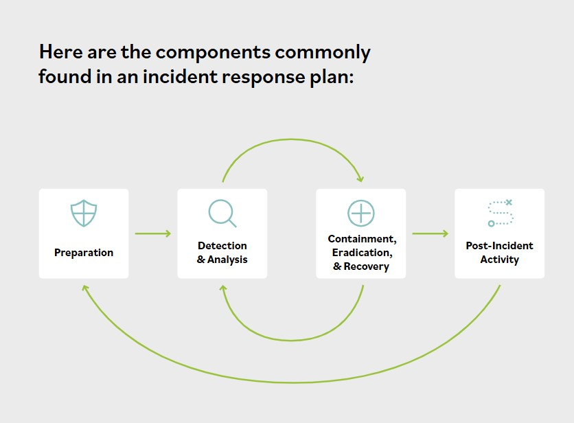

# Components of the Incident Response Plan

The incident response policy should reference an incident response plan that all employees will follow, depending on their role in the process. The plan may contain several procedures and standards related to incident response. It is a living representation of an organization’s incident response policy.

The organization’s vision, strategy and mission should shape the incident response process. Procedures to implement the plan should define the technical processes, techniques, checklists, and other tools that teams will use when responding to an incident.

### Preparation
- Develop a policy approved by management.
- Identify critical data and systems and any single points of failure.
- Train staff on incident response.
- Implement an incident response team.
- Practice Incident Identification (first response).
- Identify roles and responsibilities.
- Plan the coordination of communication between stakeholders.
- Consider the possibility that a primary method of communication may not be available.

### Detection and Analysis
- Monitor all possible attack vectors.
- Analyze the incident using known data and threat intelligence.
- Prioritize incident response.
- Standardize incident documentation.

### Containment
- Gather evidence.
- Choose an appropriate containment strategy.
- Identify the attacker.
- Isolate the attack.

### Post-Incident Activity
- Identify evidence that may need to be retained.
- Document lessons learned.
Conduct a retrospective of:
- Preparation
- Detection and Analysis
- Containment, Eradication, and Recovery
- Post-incident Activity
