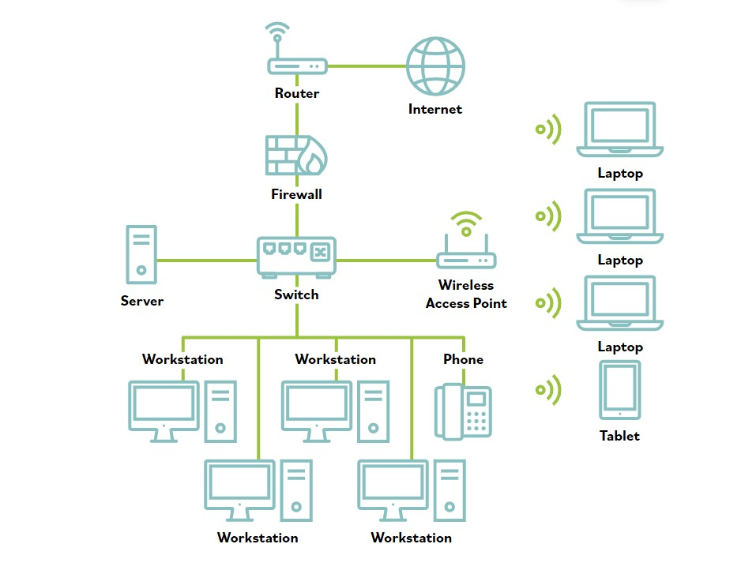
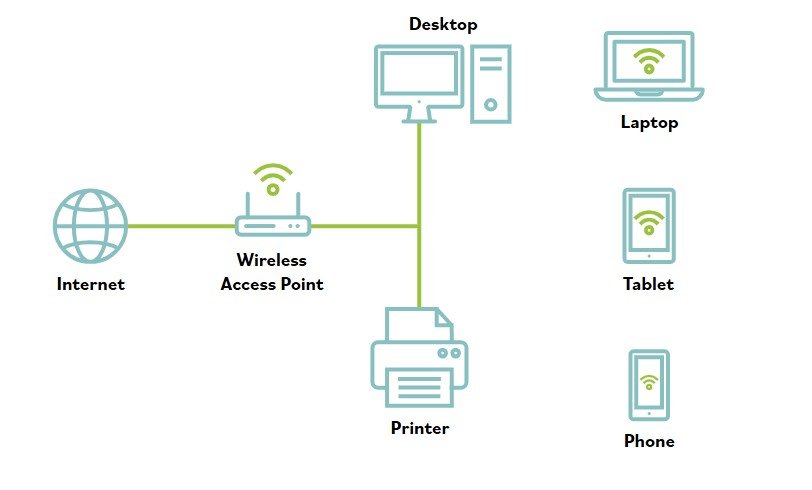

# Redes de un vistazo

### Una red de pequena empresa

Este diagrama representa una red de pequena empresa. Las lineas muestran conexiones cableadas.

Observa como todos los dispositivos detras del firewall se conectan mediante el switch de red, y el firewall se situa entre el switch de red e internet.

### Una red domestica tipica

El siguiente diagrama de red representa una red domestica tipica. Observa que la diferencia principal entre la red domestica y la red empresarial es que el router, firewall y switch de red a menudo se combinan en un solo dispositivo suministrado por tu proveedor de internet, mostrado aqui como el punto de acceso inalambrico.

