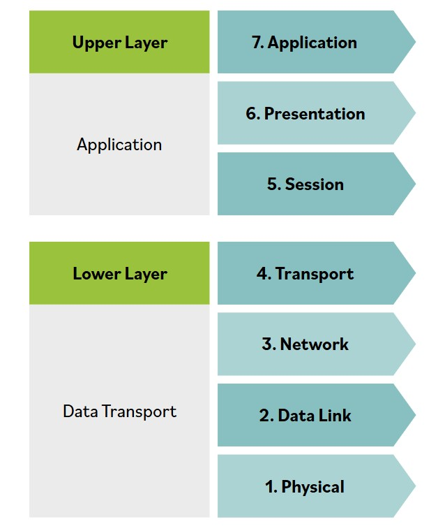

# Modelos de red

Existen muchos modelos, arquitecturas y estandares diferentes que proporcionan formas de interconectar distintos sistemas de hardware y software entre si con el proposito de compartir informacion, coordinar sus actividades y completar tareas conjuntas o compartidas.

**Las computadoras y las redes surgen de la integracion de dispositivos de comunicacion, dispositivos de almacenamiento, dispositivos de procesamiento, dispositivos de seguridad, dispositivos de entrada, dispositivos de salida, sistemas operativos, software, servicios, datos y personas.**

Traducir las necesidades de seguridad de la organizacion en sistemas de red seguros, confiables y eficaces debe empezar con una premisa simple. El proposito de todas las comunicaciones es intercambiar informacion e ideas entre personas y organizaciones para que puedan realizar su trabajo.

Esos objetivos simples pueden expresarse nuevamente en terminos de red y seguridad, como:
- Proporcionar comunicaciones confiables y gestionadas entre hosts y usuarios.
- Aislar funciones en capas.
- Usar paquetes como base de la comunicacion.
- Estandarizar enrutamiento, direccionamiento y control.
- Permitir que las capas mas alla de la interconexion de redes agreguen funcionalidad.
- Ser agnostico respecto al proveedor, escalable y resiliente.

### En su forma mas basica, un modelo de red tiene al menos dos capas:

**Capa superior**

La capa superior, tambien conocida como capa de host o de aplicacion, es responsable de gestionar la integridad de una conexion y controlar la sesion, asi como de establecer, mantener y terminar sesiones de comunicacion entre dos computadoras. Tambien es responsable de transformar los datos recibidos desde la capa de aplicacion a un formato que cualquier sistema pueda entender. Finalmente, permite que las aplicaciones se comuniquen y determina si un socio de comunicacion remoto esta disponible y accesible.

**Capa inferior**

La capa inferior suele denominarse capa de medios o de transporte y es responsable de recibir bits desde el medio fisico de conexion y convertirlos en una trama. Las tramas se agrupan en tamanos estandarizados. Piensa en las tramas como cubos y en los bits como agua. Si los cubos tienen tamanos similares y el agua esta contenida dentro de ellos, los datos pueden transportarse de manera controlada. Los datos de ruta se agregan a las tramas de datos para crear paquetes. En otras palabras, se agrega una direccion de destino al cubo. Una vez que los cubos estan listos para salir, la capa de host toma el control.
