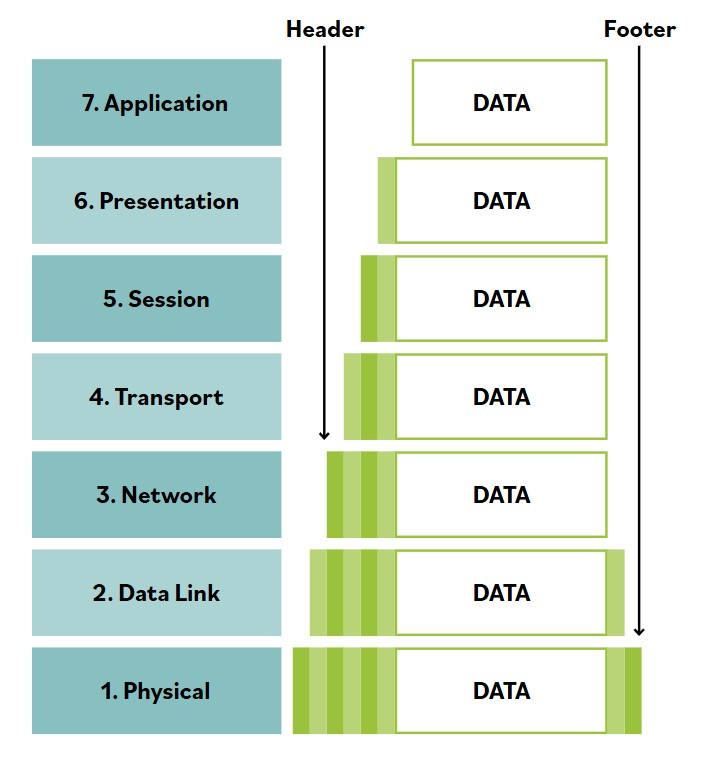

# Modelo Open Systems Interconnection (OSI)

**El modelo OSI fue desarrollado para establecer una forma comun de describir la estructura de comunicacion de sistemas informaticos interconectados.**

**El modelo OSI sirve como un marco abstracto, o modelo teorico, de como deberian funcionar los protocolos en un mundo ideal, sobre hardware ideal. Asi, el modelo OSI se ha convertido en una referencia conceptual comun que se usa para comprender la comunicacion de diversos componentes jerarquicos, desde interfaces de software hasta hardware fisico.**

El modelo OSI divide las tareas de red en siete capas distintas. Cada capa es responsable de realizar tareas u operaciones especificas con el objetivo de apoyar el intercambio de datos (en otras palabras, la comunicacion de red) entre dos computadoras. Las capas se referencian indistintamente por nombre o por numero de capa.

Por ejemplo, la Capa 3 tambien se conoce como capa de red. Las capas estan ordenadas especificamente para indicar como fluye la informacion a traves de los distintos niveles de comunicacion. Cada capa se comunica directamente con la capa superior y la capa inferior. Por ejemplo, la capa 3 se comunica tanto con la capa de enlace de datos (2) como con la capa de transporte (4).

Las capas de aplicacion, presentacion y sesion (5-7) se denominan comunmente simplemente datos. Sin embargo, cada capa tiene el potencial de realizar encapsulacion. **Encapsulacion** es la adicion de datos de cabecera y posiblemente de pie (trailer) por parte de un protocolo usado en esa capa del modelo OSI. La encapsulacion es especialmente importante al hablar de las capas de transporte, red y enlace de datos (2-4), que generalmente incluyen alguna forma de cabecera. En la capa fisica (1), la unidad de datos se convierte a binario, por ejemplo, 01010111, y se envia a traves de cables fisicos como un cable ethernet.

Vale la pena mapear alguna terminologia comun de redes al modelo OSI para que puedas ver el valor del modelo conceptual.

### Considera los siguientes ejemplos:

- **Cuando alguien se refiere a un archivo de imagen como JPEG o PNG, estamos hablando de la capa de presentacion (6).**
- **Cuando se habla de puertos logicos como NetBIOS, estamos hablando de la capa de sesion (5).**
- **Cuando se habla de TCP/UDP, estamos hablando de la capa de transporte (4).**
- **Cuando se habla de routers que envian paquetes, estamos hablando de la capa de red (3).**
- **Cuando se habla de switches, bridges o WAPs que envian tramas, estamos hablando de la capa de enlace de datos (2).**

  La encapsulacion ocurre a medida que los datos descienden por el modelo OSI desde aplicacion hasta fisica. A medida que los datos se encapsulan en cada capa descendente, la cabecera, carga util y pie de la capa anterior se tratan como la carga util de la siguiente capa. El tamano de la unidad de datos aumenta a medida que descendemos por el modelo conceptual y los contenidos siguen encapsulandose.

  La accion inversa ocurre cuando los datos ascienden por las capas del modelo OSI desde fisica hasta aplicacion. Este proceso se conoce como desencapsulacion (o decapsulacion). La cabecera y el pie se usan para interpretar correctamente la carga util de datos y luego se descartan. A medida que ascendemos por el modelo OSI, la unidad de datos se vuelve mas pequena. El proceso de encapsulacion/desencapsulacion se representa mejor visualmente a continuacion:

  

  
