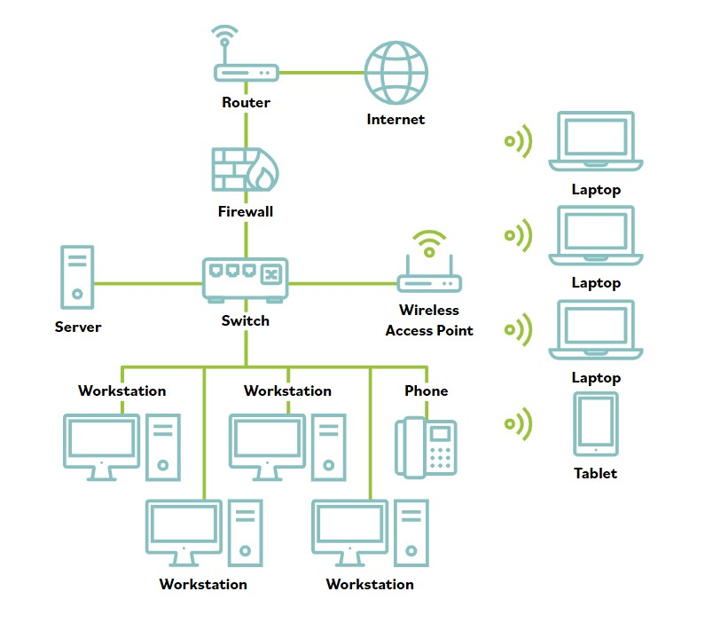

# Wi-Fi

**Las redes inalambricas son un metodo popular para conectar sistemas corporativos y domesticos por su facilidad de despliegue y costo relativamente bajo.**

**Han hecho que las redes sean mas versatiles que nunca. Las estaciones de trabajo y sistemas portatiles ya no estan atados a un cable, sino que pueden moverse libremente dentro del alcance de senal de los puntos de acceso inalambricos desplegados. Sin embargo, con esta libertad llegan vulnerabilidades adicionales.**

El alcance de Wi-Fi generalmente es lo bastante amplio para la mayoria de hogares u oficinas pequenas, y los extensores de alcance pueden colocarse estrategicamente para extender la senal en campus o viviendas mas grandes. Con el tiempo, el estandar Wi-Fi ha evolucionado, y cada version actualizada es mas rapida que la anterior.

En una LAN, los actores de amenaza necesitan entrar en el espacio fisico o en la cercania inmediata del propio medio fisico. En redes cableadas, esto puede hacerse colocando taps de sniffing en cables, conectando dispositivos USB o usando otras herramientas que requieren acceso fisico a la red. En cambio, las intrusiones en medios inalambricos pueden ocurrir a distancia.

