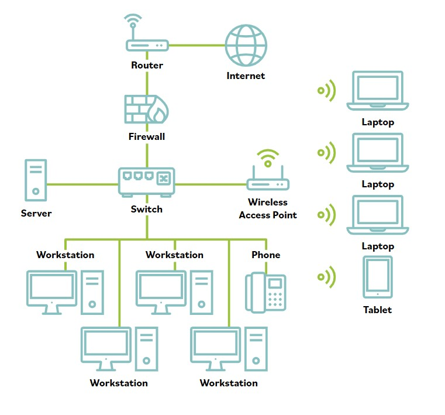

# Seguridad de la red

Las vulnerabilidades de TCP/IP son numerosas. Las pilas TCP/IP implementadas incorrectamente en diversos sistemas operativos son vulnerables a varios ataques DoS/DDoS, ataques de fragmentacion, ataques con paquetes sobredimensionados, ataques de spoofing y ataques man-in-the-middle.

TCP/IP (asi como la mayoria de los protocolos) tambien esta sujeto a ataques pasivos mediante monitoreo o sniffing. El monitoreo de red, o sniffing, es el acto de monitorear patrones de trafico para obtener informacion sobre una red.

