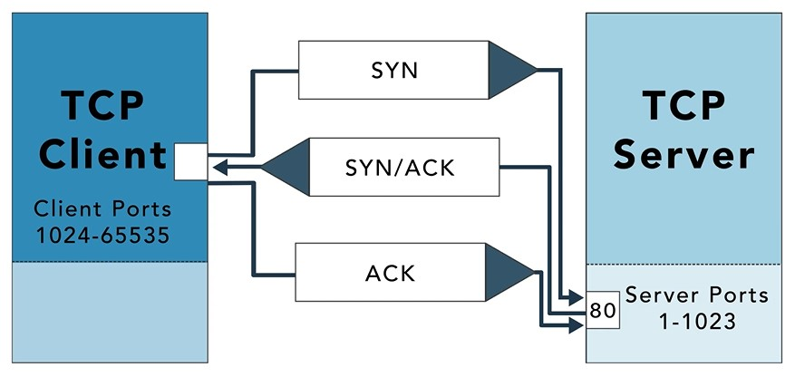

# SYN, SYN-ACK, ACK Handshake

Between the client and server. There is a system for synchronizing and acknowledging any request that is known as a three way handshake. This handshake is used to establish a TCP connection between two devices. Here we will take a simplified look at how communications are established to a web server. Depending on the exact protocol. There may be additional connection negotiation taking place first, the client sends synchronization sin packet to the web servers. Port 80 or 443. This is a request to establish a connection. The web server replies to the sin packet with an acknowledgment known as a sin A. Finally, the client acknowledges the connection with an acknowledgment ac at this point, the basic connection is established and the client and host will further negotiate secure communications over that connection.

