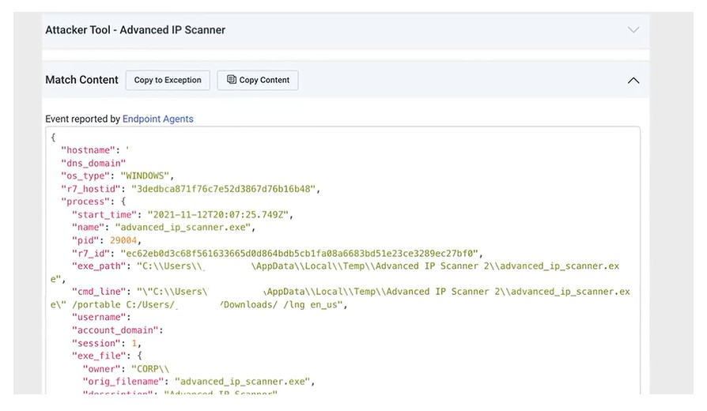
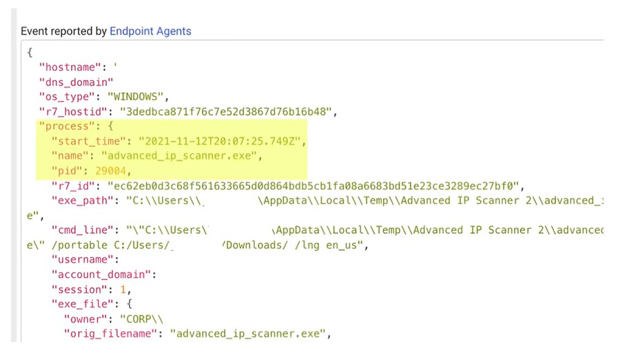
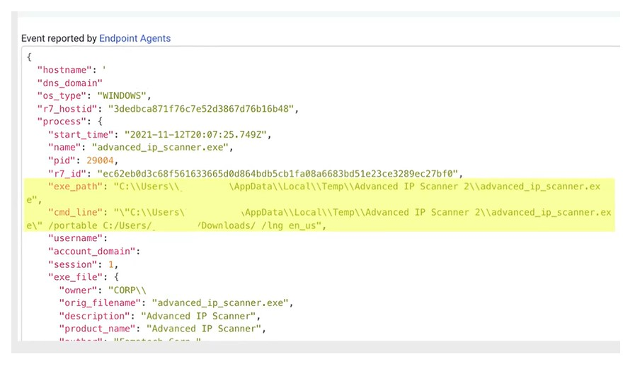

# Identificacion de amenazas

Aqui vemos un ejemplo de una alerta de intrusion detection system (IDS). Se proporciona como ejemplo de como se identifican amenazas. Algunos conceptos de este escenario son mas avanzados que este curso, asi que no te alarmes si no entiendes todo lo que se trata aqui. Empezaremos revisando los puntos principales de los datos que se nos presentan.

Observa que, en este ejemplo, los campos de nombre de host y nombre de usuario se han eliminado para mantener el anonimato. Esto nos indica que el IDS detecto el uso de un software llamado Advanced IP Scanner, que puede ser usado por atacantes para enumerar o revisar la red escaneando direcciones y ver que servicios se estan ejecutando en las computadoras de la red local. Este software tambien es usado por administradores de red o de sistemas para inventariar una red local con fines de resolucion de problemas.

Finalmente, esta seccion superior de la pantalla de alerta nos indica que el evento fue reportado por un agente de endpoint, lo que significa que fue generado por una solucion host intrusion detection system (HIDS), no por un network intrusion detection system (NIDS). Esta linea identifica el host que ejecuta el proceso sospechoso como un sistema Windows.

La seccion de proceso identifica la hora de inicio, el nombre del proceso y el ID o numero PID que se correlaciona con el proceso en el Administrador de tareas de Windows. Esto puede ser util de un par de formas. Primero, la hora de inicio nos indica cuanto tiempo ha estado ejecutandose el proceso. El PID tambien puede dar algunas pistas, ya que numeros PID mas bajos pueden indicar un proceso que empezo a ejecutarse durante la secuencia de arranque, y numeros mas altos indican algo que se inicio mucho mas tarde.

Estas lineas nos dan detalles del archivo ejecutable, incluida la ruta al propio archivo, asi como la linea de comandos real usada para ejecutar el ejecutable. Esto es importante contextualmente porque muestra que el programa se ejecuto desde una carpeta temporal bajo el ID del usuario, lo que normalmente no requiere privilegios administrativos en un sistema Windows. En otras palabras, podria ejecutarlo cualquier usuario promedio. La linea de comandos usada muestra contexto adicional, incluido que la aplicacion se esta ejecutando como una aplicacion portable, lo que significa que no tiene que estar formalmente instalada en la maquina para ejecutarse.

En este caso, no hay suficiente contexto para saber realmente si este proceso se esta usando de manera maliciosa. Como muchas alertas de seguridad, esta depende de cierta interaccion humana. Por tanto, debes contactar al usuario final asignado a este activo para preguntar si efectivamente esta ejecutando este software y si tiene una razon legitima de negocio para hacerlo. Si descubres que era intencional, tambien podria ser un buen momento para explicar que fuiste alertado porque este software legitimo puede ser usado por actores de amenaza para realizar reconocimiento en la red local y determinar donde podria haber debilidades que explotar.

