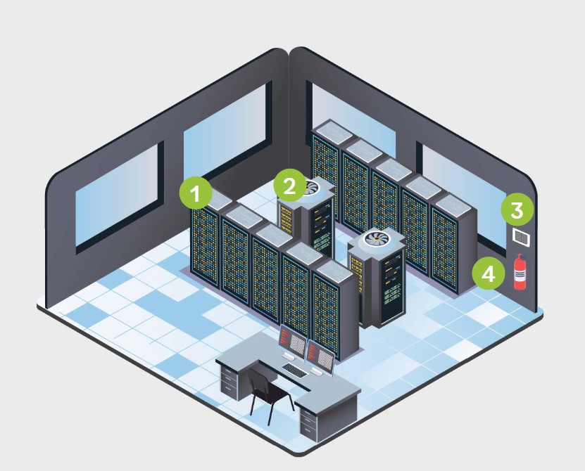

# On-Premises Data Centers

**When it comes to data centers, there are two primary options: organizations can outsource the data center or own the data center. If the data center is owned, it will likely be built on premises. A place, like a building for the data center, is needed, along with power, HVAC, fire suppression, and redundancy.**

### 1. Data Center/Closets

The facility wiring infrastructure is integral to overall information system security and reliability. Protecting access to the physical layer of the network is important in minimizing intentional or unintentional damage. Proper protection of the physical site must address these sorts of security challenges.

Data centers and wiring closets may include the following:

- Phone, network, special connections
- ISP or telecommunications provider equipment
- Servers
- Wiring and/or switch components

