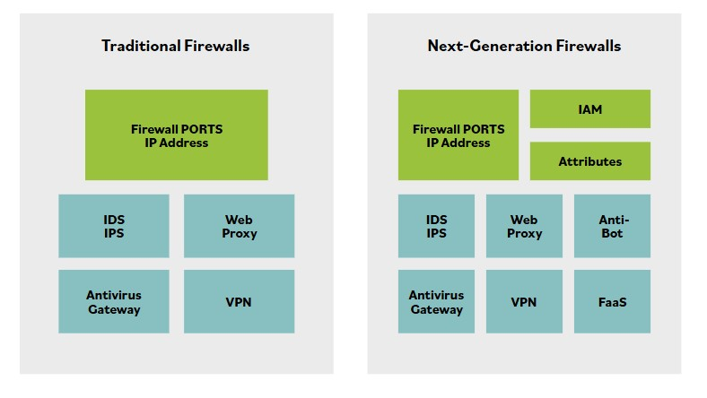
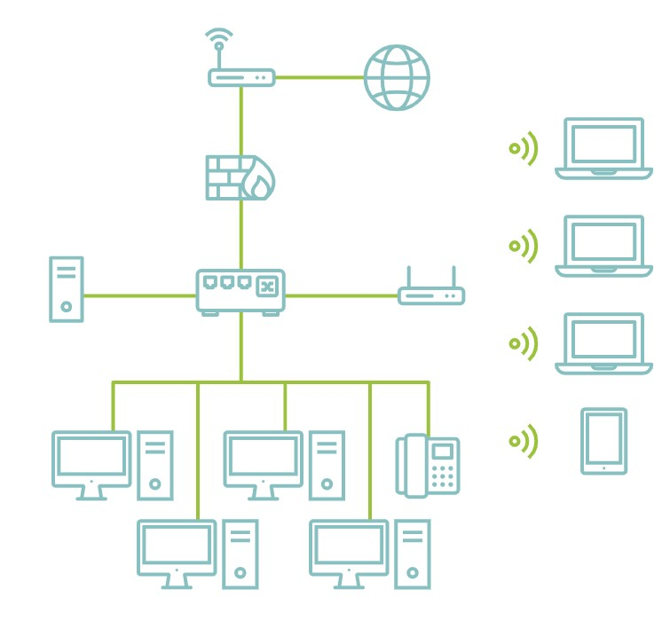

# Prevencion de amenazas

**Aunque no hay un unico paso que puedas tomar para protegerte contra todas las amenazas, hay algunos pasos basicos que ayudan a reducir el riesgo de muchos tipos de amenaza:**

**Mantener sistemas y aplicaciones actualizados.** Los proveedores publican regularmente parches para corregir errores y fallos de seguridad, pero estos solo ayudan cuando se aplican. La gestion de parches asegura que los sistemas y aplicaciones se mantengan actualizados con parches relevantes.

**Eliminar o deshabilitar servicios y protocolos innecesarios.** Si un sistema no necesita un servicio o protocolo, no deberia estar ejecutandolo. Los atacantes no pueden explotar una vulnerabilidad en un servicio o protocolo que no se esta ejecutando en un sistema. Como contraste extremo, imagina que un servidor web ejecuta todos los servicios y protocolos disponibles. Es vulnerable a ataques potenciales contra cualquiera de esos servicios y protocolos.

**Usar sistemas de deteccion y prevencion de intrusiones.** Los sistemas de deteccion y prevencion de intrusiones observan actividad, intentan detectar amenazas y proporcionan alertas. A menudo pueden bloquear o detener ataques.

**Usar firewalls.** Los firewalls pueden prevenir muchos tipos diferentes de amenazas. Los firewalls basados en red protegen redes completas, y los firewalls basados en host protegen sistemas individuales.

**Usar software anti-malware actualizado.** Una contramedida principal es el software anti-malware.

### Antivirus

**Se recomienda firmemente el uso de productos antivirus como buena practica de seguridad y es un requisito para cumplir con el Payment Card Industry Data Security Standard (PCI DSS).**

Hay varios productos antivirus disponibles, y muchos pueden desplegarse como parte de una solucion empresarial que se integra con varios otros productos de seguridad.

Los sistemas antivirus intentan identificar malware basandose en la firma de malware conocido o detectando actividad anormal en un sistema. Esta identificacion se realiza con varios tipos de escaneres, reconocimiento de patrones y algoritmos avanzados de machine learning.

Anti-malware ahora va mas alla de la proteccion contra virus, ya que las soluciones modernas intentan proporcionar un enfoque mas holistico detectando rootkits, ransomware y spyware. Muchas soluciones de endpoint tambien incluyen firewalls de software y sistemas IDS o IPS.

### Escaneos

**Aqui hay un ejemplo de escaneo de Zenmap que muestra puertos abiertos en un host.**

Los escaneos regulares de vulnerabilidades y puertos son una buena forma de evaluar la efectividad de los controles de seguridad usados dentro de una organizacion.

Pueden revelar areas donde los parches o configuraciones de seguridad son insuficientes, donde nuevas vulnerabilidades se han desarrollado o han quedado expuestas, y donde las politicas de seguridad son ineficaces o no se estan siguiendo. Los atacantes pueden explotar cualquiera de estas vulnerabilidades.

### Firewalls

**En construccion de edificios o diseno de vehiculos, un firewall es una barrera fisica especialmente construida que impide la propagacion del fuego de un area de la estructura a otra, o de un compartimento de un vehiculo a otro.**

Los primeros ingenieros de seguridad informatica tomaron prestado ese nombre para los dispositivos y servicios que aislan segmentos de red entre si como medida de seguridad. Como resultado, firewalling se refiere al proceso de disenar, usar u operar diferentes procesos de formas que aislan actividades de alto riesgo de otras de menor riesgo.

Los firewalls hacen cumplir politicas filtrando trafico de red basandose en un conjunto de reglas. Aunque un firewall siempre deberia colocarse en las puertas de enlace a internet, otras consideraciones y condiciones internas de red determinan donde se emplearia un firewall, como la zonificacion de red o la segregacion de distintos niveles de sensibilidad.

Los firewalls han evolucionado rapidamente con el tiempo para proporcionar capacidades de seguridad mejoradas. Este crecimiento en capacidades puede verse en el grafico siguiente, que contrasta una vista sobresimplificada de firewalls tradicionales y de proxima generacion.

Integra una variedad de capacidades de gestion de amenazas en un unico marco, incluidos servicios proxy, servicios de prevencion de intrusiones (IPS) y una integracion estrecha con el entorno de identity and access management (IAM) para asegurar que solo usuarios autorizados puedan pasar trafico a traves de la infraestructura. Aunque los firewalls pueden gestionar trafico en las Capas 2 (direcciones MAC), 3 (rangos IP) y 7 (application programming interface (API) y firewalls de aplicacion), la implementacion tradicional ha sido controlar trafico en la Capa 4.

### Intrusion Prevention System (IPS)

**Un intrusion prevention system (IPS), o sistema de prevencion de intrusiones, es un tipo especial de IDS activo que intenta detectar y bloquear automaticamente ataques antes de que lleguen a los sistemas objetivo.**

Una diferencia distintiva entre un IDS y un IPS es que el IPS se coloca en linea con el trafico.

En otras palabras, todo el trafico debe pasar por el IPS, y el IPS puede elegir que trafico reenviar y que trafico bloquear despues de analizarlo. Esto permite que el IPS evite que un ataque llegue a un objetivo. Como los sistemas IPS son mas eficaces para prevenir ataques basados en red, es comun ver la funcion IPS integrada en firewalls. Igual que IDS, existen IPS basados en red (NIPS) e IPS basados en host (HIPS).

