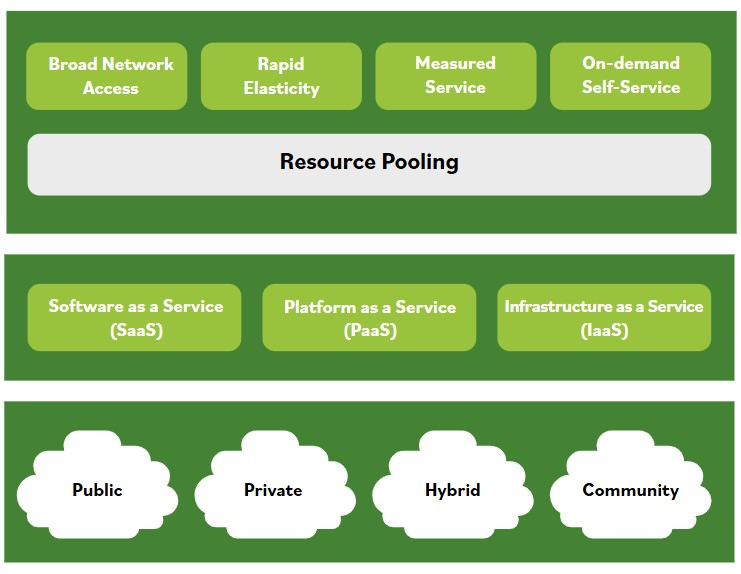

# Cloud Computing

**Cloud computing is usually associated with an internet-based set of computing resources, and typically sold as a service provided by a cloud service provider (CSP).**

Cloud computing is similar to the electrical or power grid. It is provisioned in a geographic location and is sourced using an electrical means that is not necessarily obvious to the consumer. However, when you want electricity, it's available via a common standard interface and you pay only for what you use.

Cloud computing is scalable, elastic, and easy-to-use for the provisioning and deployment of Information Technology (IT) services.

There are various definitions of what cloud computing means per leading standards, including NIST's.

This NIST definition is commonly used around the globe, cited by professionals to clarify what the term "cloud" means:

*"A model for enabling ubiquitous, convenient, on-demand network access to a shared pool of configurable computing resources (such as networks, servers, storage, applications, and services) that can be rapidly provisioned and released with minimal management effort or service provider interaction."*
NIST SP 800-145

### This image depicts cloud computing characteristics, service, and deployment models.

