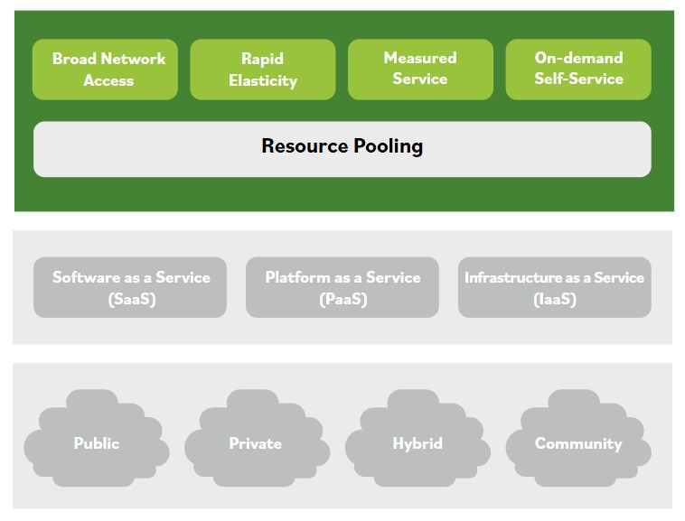

# Caracteristicas de la nube

Los activos basados en la nube incluyen cualquier recurso al que una organizacion accede usando computacion en la nube. La computacion en la nube se refiere al acceso bajo demanda a recursos de computo disponibles desde casi cualquier lugar, y los recursos de computacion en la nube son altamente disponibles y facilmente escalables. Las organizaciones normalmente arriendan recursos basados en la nube desde fuera de la organizacion.

### La computacion en la nube tiene muchos beneficios para las organizaciones, que incluyen, entre otros:

- El uso se mide y se cobra segun unidades (o instancias) consumidas. Esto tambien puede facturarse internamente a departamentos o funciones especificas.
- Reduccion de costos de energia y refrigeracion, junto con un efecto de entorno "green IT" mediante el uso optimo de recursos y sistemas de TI.
- Reduccion del costo de propiedad. No hay necesidad de comprar activos para uso diario, no hay perdida de valor del activo con el tiempo y se reducen otros costos relacionados de mantenimiento y soporte.
- Permite que una empresa escale rapidamente nuevos servicios/soluciones de software o basados en datos mediante sistemas en la nube, sin tener que instalar hardware masivo localmente.

