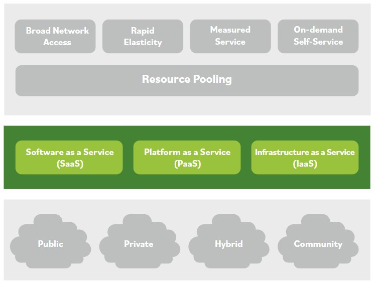

# Service Models

Some cloud-based services only provide data storage and access. When storing data in the cloud, organizations must ensure that security controls are in place to prevent unauthorized access to the data.

There are varying levels of responsibility for assets depending on the service model. This includes maintaining the assets, ensuring they remain functional, and keeping the systems and applications up to date with current patches.

In some cases, the cloud service provider is responsible for these steps. In other cases, the consumer is responsible.

Types of cloud computing service models include Software as a Service (SaaS), Platform as a Service (PaaS), and Infrastructure as a Service (IaaS).

