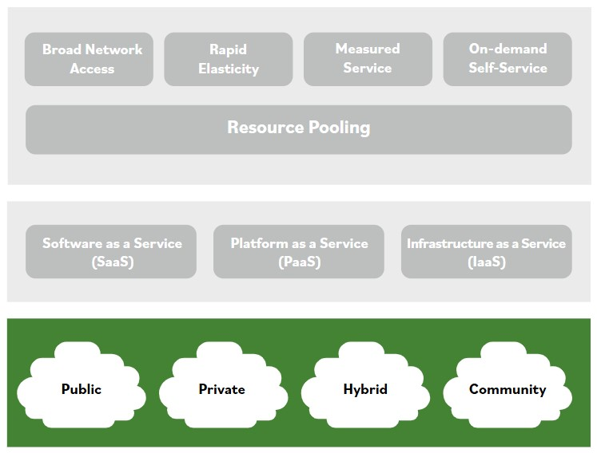

# Modelos de despliegue

Hay cuatro modelos de despliegue en la nube. El modelo de despliegue en la nube tambien afecta la distribucion de responsabilidades sobre los activos basados en la nube.

**Los cuatro modelos de nube disponibles son publico, privado, hibrido y comunitario.**

### Publico

Las nubes publicas se conocen comunmente como nubes para el usuario publico. Es facil acceder a una nube publica. No hay un mecanismo real, aparte de solicitar y pagar el servicio en la nube. Esta abierta al publico y, por lo tanto, es un recurso compartido que muchas personas pueden usar como parte de un pool de recursos.

Un modelo de despliegue de nube publica incluye activos disponibles para que cualquier consumidor los alquile o arriende, y esta alojado por un cloud service provider (CSP) externo. Los service-level agreements pueden ser eficaces para asegurar que el CSP proporcione los servicios basados en la nube a un nivel aceptable para la organizacion.

### Privado

Las nubes privadas comienzan con el mismo concepto tecnico que las nubes publicas, excepto que, en lugar de compartirse con el publico, generalmente se desarrollan y despliegan para una organizacion privada que construye su propia nube. Las organizaciones pueden crear y alojar nubes privadas usando sus propios recursos. Por lo tanto, este modelo de despliegue incluye activos basados en la nube para una sola organizacion. Como tal, la organizacion es responsable de todo el mantenimiento. Sin embargo, una organizacion tambien puede alquilar recursos de un tercero y dividir los requisitos de mantenimiento segun el modelo de servicio (SaaS, PaaS o IaaS). Las nubes privadas proporcionan a organizaciones y departamentos acceso privado a los activos de computo, almacenamiento, redes y software disponibles en la nube privada.

### Hibrido

Un modelo de despliegue de nube hibrida se crea combinando dos formas de modelos de despliegue de computacion en la nube, normalmente una nube publica y una privada. La computacion en nube hibrida esta ganando popularidad en organizaciones al proporcionarles la capacidad de conservar control sobre sus entornos de TI, permitirles usar convenientemente servicios de nube publica para cargas de trabajo no criticas para la mision, y aprovechar flexibilidad, escalabilidad y ahorro de costos.

Impulsores o beneficios importantes de los despliegues de nube hibrida incluyen: conservar propiedad y supervision de tareas y procesos criticos relacionados con tecnologia, reutilizar inversiones previas en tecnologia dentro de la organizacion, controlar los componentes y sistemas de negocio mas criticos, y medios rentables para cumplir funciones de negocio no criticas.

### Comunitario

Las nubes comunitarias pueden ser publicas o privadas. Lo que las hace unicas es que generalmente se desarrollan para una comunidad particular. Un ejemplo podria ser una nube comunitaria publica enfocada principalmente en alimentos organicos, o tal vez una nube comunitaria enfocada especificamente en servicios financieros.

La idea detras de la nube comunitaria es que personas con mentalidades o intereses similares puedan reunirse, compartir capacidades y servicios de TI, y usarlos de una forma beneficiosa para los intereses particulares que comparten.
