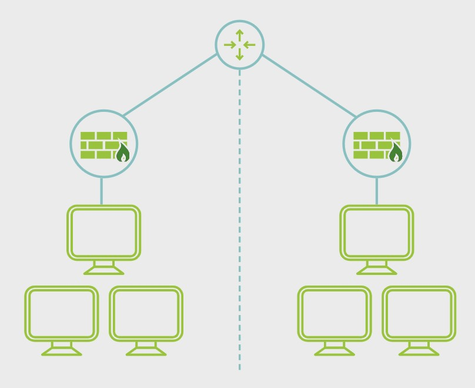
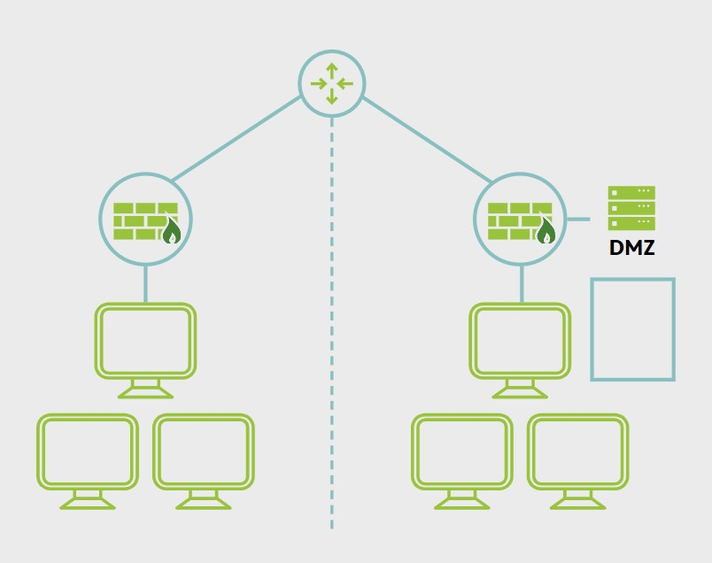
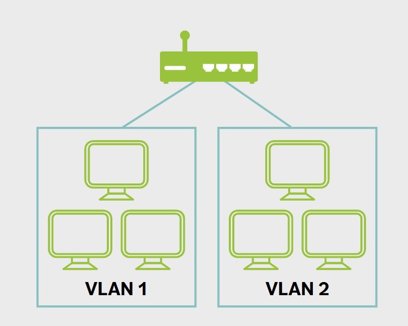
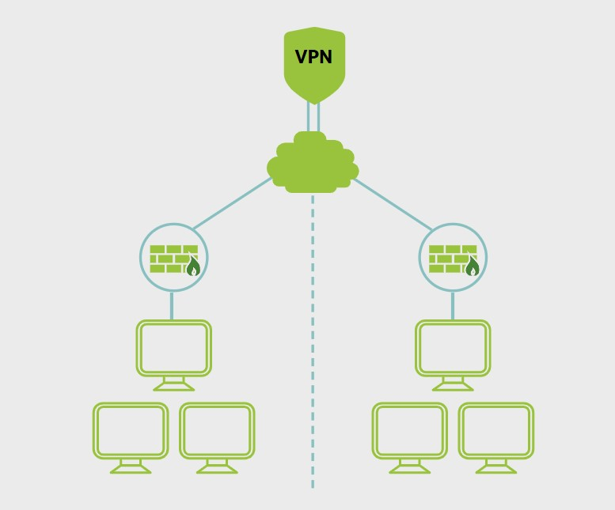
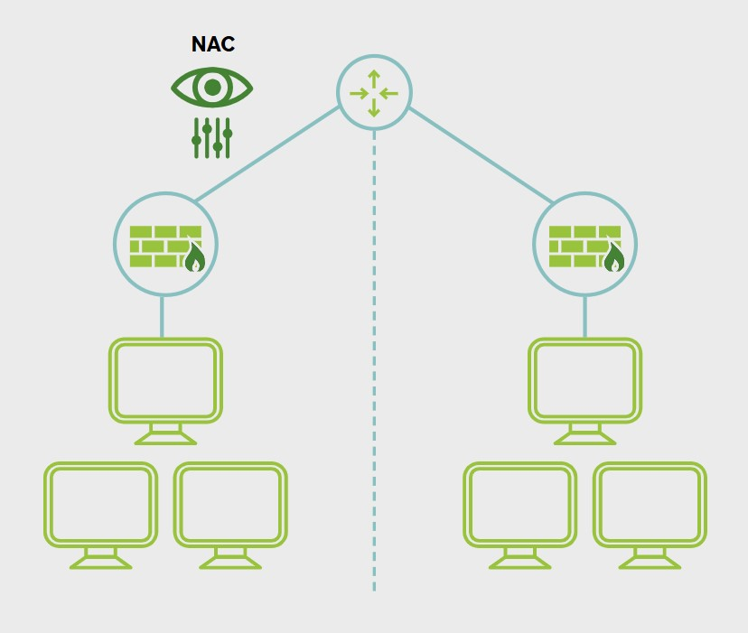

# Network Design

**The objective of network design is to satisfy data communication requirements and achieve the result of efficient overall performance.**

### Network Segmentation

Network segmentation involves controlling traffic among networked devices. Complete or physical network segmentation occurs when a network is isolated from all outside communications, so transactions can only occur between devices within the segmented network.

### Demilitarized Zone (DMZ)

A DMZ is a network area that is designed to be accessed by outside visitors but is still isolated from the private network of the organization. The DMZ is often the host of public web, email, file and other resource servers.

### Virtual Local Area Network (VLAN)

VLANs are created by switches to logically segment a network without altering its physical topology.

### Virtual Private Network (VPN)

A virtual private network (VPN) is a communication tunnel that provides point-to-point transmission of both authentication and data traffic over an untrusted network.

### Defense in depth

Defense in depth uses multiple types of access controls in literal or theoretical layers to help an organization avoid a monolithic security stance.

### Network Access Control (NAC)

Network access control (NAC) is a concept of controlling access to an environment through strict adherence to and implementation of security policy.

