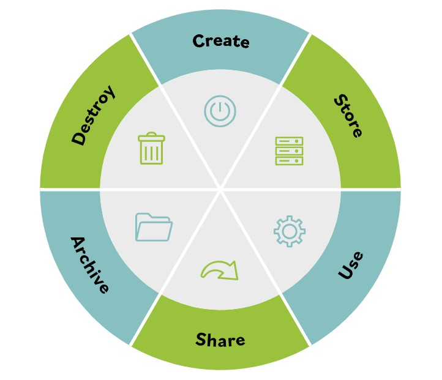

# Data Handling

**Data goes through its own life cycle as users create, utilize, share, and modify it. Many different models of the life of a data item can be found, but they all have some basic operational steps in common.**

The data security life cycle model is useful because it can align easily with the different roles that people and organizations perform during the evolution of data from creation to destruction (or disposal).

It also helps put the different data states of in use, at rest and in motion, into context. Let's take a closer look.

### All ideas, data, information, or knowledge can be thought of as performing six major sets of activities throughout its lifetime. Conceptually, these involve:

- **Create**

Creating the knowledge, which is usually tacit knowledge at this point.

- **Store**

Storing or recording it in some fashion that makes it explicit.

- **Use**

Using the knowledge, which may cause the information to be modified, supplemented, or partially deleted.

- **Share**

Sharing the data with other users, whether as a copy or by moving the data from one location to another.

- **Archive**

Archiving the data when it is temporarily not needed.

- **Destroy**

Destroying the data when it is no longer needed.
