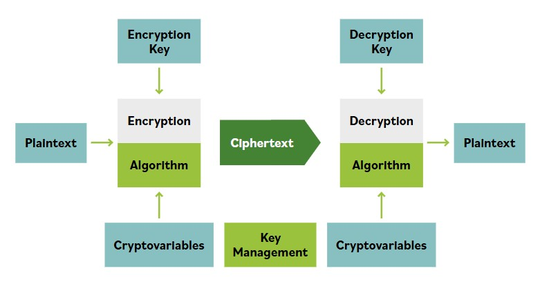

# Encryption Overview

**Almost every action we take in our modern digital world involves cryptography. Encryption protects our personal and business transactions; digitally signed software updates verify their creator’s or supplier’s claim to authenticity.**

Digitally signed contracts, binding to all parties, are routinely exchanged via email without fear of being repudiated later by the sender.

Cryptography is used to protect information by keeping its meaning or content secret and making it unintelligible to someone who does not have a way to decrypt (unlock) that protected information.

The objective of every encryption system is to transform an original set of data, called the plaintext, into an otherwise unintelligible encrypted form, called the ciphertext.

Properly used, singly or in combination, cryptographic solutions provide a range of services that can help achieve required systems security postures in many ways:

### Confidentiality

Cryptography provides confidentiality by hiding or obscuring a message so that it cannot be understood by anyone except the intended recipient. Confidentiality keeps information secret from those who are not authorized to have it.

### Integrity

Hash functions and digital signatures can provide integrity services that allow a recipient to verify that a message has not been altered by malice or error. These include simple message integrity controls. Any changes made by the sender or the recipient, either deliberate or accidental, will result in two different results.

### Encryption System

An encryption system is a set of hardware, software, algorithms, control parameters, and operational methods that provide a set of encryption services.

### Plaintext

Plaintext is the data or message in its normal, unencrypted form and format. Its meaning or value to an end user (a person or a process) is immediately available for use.

Plaintext can be:

- Image, audio, or video files in their raw or compressed forms

- Human-readable text and numeric data, with or without markup language elements for formatting and metadata

- Database files or records and fields within a database

- Anything else that can be represented in digital form for computer processing, transmission, and storage

It is important to remember that plaintext can be anything and that much of it is not readable to humans.

