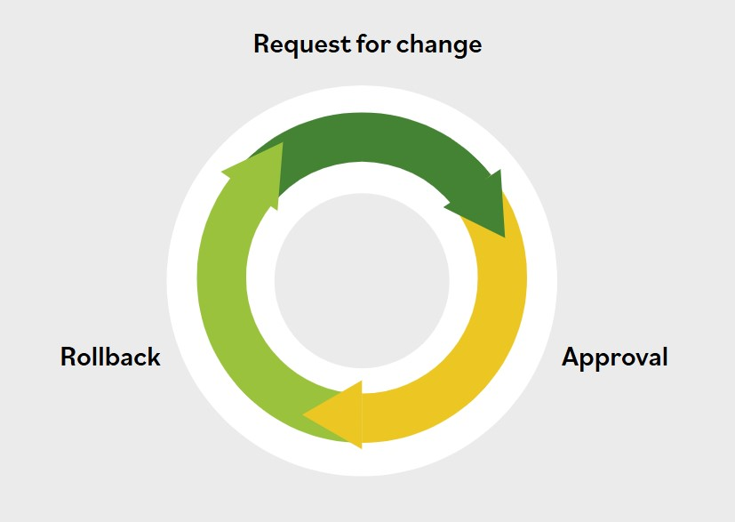

# Change Management Components

**The change management process includes the following components.**

### Documentation

All of the major change management practices address a common set of core activities that start with a request for change (RFC) and move through various development and test stages until the change is released to the end users. From first to last, each step is subject to some form of formalized management and decision-making; each step produces accounting or log entries to document its results.

### Approval

These processes typically include: Evaluating the RFCs for completeness, assignment to the proper change authorization process based on risk and organizational practices, stakeholder reviews, resource identification and allocation, appropriate approvals or rejections, and documentation of approval or rejection.

### Rollback

Depending upon the nature of the change, a variety of activities may need to be completed. These generally include: scheduling the change, testing the change, verifying the rollback procedures, implementing the change, evaluating the change for proper and effective operation, and documenting the change in the production environment.

Rollback authority would generally be defined in the rollback plan, which might be immediate or scheduled as a subsequent change if monitoring of the change suggests inadequate performance.
