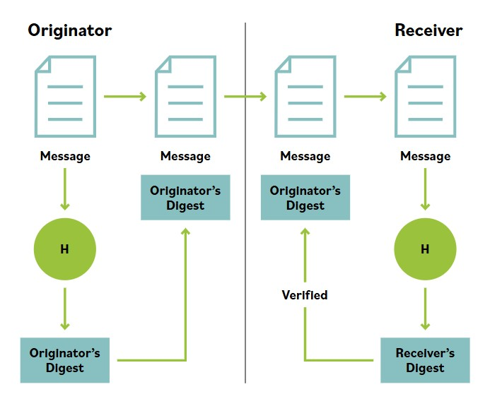

# Hashing

**Hashing takes an input set of data of almost arbitrary size and returns a fixed-length result called the hash value. A hash function is the algorithm used to perform this transformation. When used with cryptographically strong hash algorithms, this is the most common method of ensuring message integrity today.**

**Hashes have many uses in computing and security, one of which is to create a message digest by applying such a hash function to the plaintext body of a message.**

To be useful and secure, a cryptographic hash function must demonstrate five main properties:

- **Useful:** It is easy to compute the hash value for any given message.

- **Nonreversible:** It is computationally infeasible to reverse the hash process or otherwise derive the original plaintext of a message from its hash value, unlike an encryption process, for which there must be a corresponding decryption process.

- **Content integrity assurance:** It is computationally infeasible to modify a message such that reapplying the hash function will produce the original hash value.

- **Unique:** It is computationally infeasible to find two or more different, sensible messages that hash to the same value.

- **Deterministic:** The same input will always generate the same hash, when using the same hashing algorithm.

**Cryptographic hash functions have many applications in information security, including digital signatures, message authentication codes, and other forms of authentication.**

They can also be used for fingerprinting, to pinpoint duplicate data or uniquely identify files, and as checksums to detect accidental data corruption. The operation of a hashing algorithm is demonstrated in the image below.

This is an example of a simple hashing function. The originator wants to send a message to the receiver and ensure that the message is not altered by noise or lost packets as it is transmitted. The originator runs the message through a hashing algorithm that generates a hash, or a digest of the message.

The digest is appended to the message and sent together with the message to the recipient. Once the message is delivered, the receiver will generate their own digest of the received message using the same hashing algorithm. The digest of the received message is compared with the digest sent by the originator. If the digests are the same, the received message is the same as the sent message.

The problem with a simple hash function like this is that it does not protect against a malicious attacker who would be able to change both the message and the hash/digest by intercepting it in transit. The general idea of a cryptographic hash function can be summarized with the following formula:

As seen in this image, even the slightest change in the input message results in a completely different hash value.

Hash functions are sensitive to any changes in the message. Because the size of the hash digest does not vary according to the size of the message, a person cannot tell the size of the message based on the digest.

