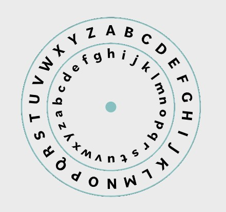

# Symmetric Encryption

**The central characteristic of asymmetric algorithm is that it uses the same key in both the encryption and the decryption processes. It could be said that the decryption process is a mirror image of the encryption process.**

**The same key is used for both the encryption and decryption processes. This means that the two parties communicating need to share knowledge of the same key.**

This type of algorithm protects data, as a person who does not have the correct key would not be able to read the encrypted message. Because the key is shared, however, this can lead to several other challenges:

- If two parties suspect a specific communication path between them is compromised, they obviously can't share key material along that path. Someone who has compromised communications between the parties would also intercept the key.

- Distribution of the key is difficult, because the key cannot be sent in the same channel as the encrypted message, or the man-in-the-middle (MITM) would have access to the key. Sending the key through a different channel (band) than the encrypted message is called out-of-band key distribution. Examples of out-of-band key distribution would include sending the key via courier, fax, or phone.

- Any party with knowledge of the key can access—and therefore change—the message.

- Each individual or group of people wishing to communicate would need to use a different key for each individual or group they want to connect with. This raises the challenge of scalability—the number of keys needed grows quickly as the number of different users or groups increases. Under this type of symmetric arrangement, an organization of 1,000 employees would need to manage 499,500 keys if every employee wanted to communicate confidentially with every other employee.

**Primary uses of symmetric algorithms:**

- Encrypting bulk data (e.g., backups, hard drives, portable media)

- Encrypting messages traversing communications channels (e.g., IPsec, TLS)

- Streaming large-scale, time-sensitive data (e.g., audio/video materials, gaming)

**Other names for symmetric algorithms:**

- Same key

- Single key

- Shared key

- Secret key

- Session key

### Symmetric Encryption Via Decoding Ring

An example of symmetric encryption is a substitution cipher, which involves the simple process of substituting letters for other letters, or more appropriately, substituting bits for other bits, based upon a cryptovariable. These ciphers involve replacing each letter of the plaintext with another that may be further down the alphabet.

