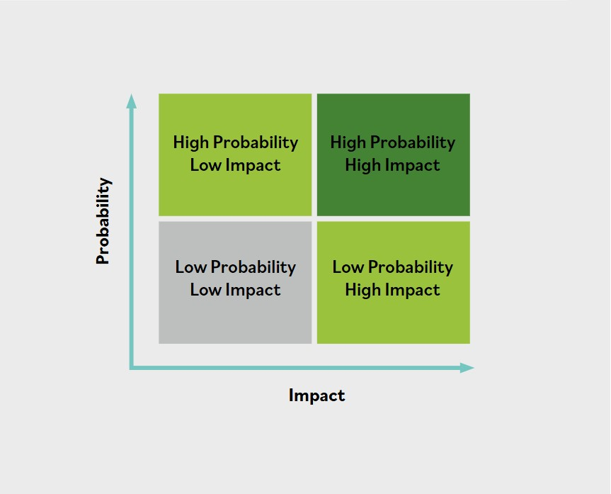

# Prioridades de riesgo

Cuando los riesgos han sido identificados, es momento de priorizar y analizar los riesgos principales mediante **analisis cualitativo de riesgos** y/o **analisis cuantitativo de riesgos**.

Esto es necesario para determinar la causa raiz y reducir la lista de riesgos aparentes y riesgos principales. Los profesionales de seguridad trabajan con sus equipos para realizar analisis tanto cualitativos como cuantitativos.

Comprender la mision general de la organizacion y las funciones que respaldan esa mision ayuda a situar los riesgos en contexto, determinar las causas raiz y priorizar la evaluacion y el analisis de estos elementos. En la mayoria de los casos, la direccion proporcionara orientacion para usar los hallazgos de la evaluacion de riesgos a fin de determinar un conjunto priorizado de acciones de respuesta al riesgo.

Un metodo eficaz para priorizar riesgos es usar una matriz de riesgo, que ayuda a identificar la prioridad como la interseccion entre la probabilidad de ocurrencia y el impacto.

Tambien proporciona al equipo un lenguaje comun para usar con la direccion al determinar las prioridades finales. Por ejemplo, una baja probabilidad y un bajo impacto podrian dar como resultado una prioridad baja, mientras que un incidente con alta probabilidad y alto impacto resultara en una prioridad alta. La asignacion de prioridad puede estar relacionada con las prioridades del negocio, el costo de mitigar un riesgo o el potencial de perdida si ocurre un incidente.

