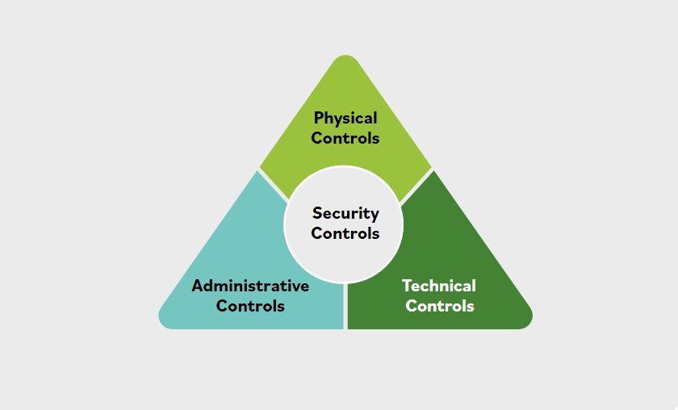

# Que son los controles de seguridad?

### Controles de seguridad
Los controles de seguridad se refieren a los mecanismos fisicos, tecnicos y administrativos que actuan como salvaguardas o contramedidas para proteger la confidencialidad, integridad y disponibilidad del sistema y de su informacion.

La implementacion de controles debe reducir el riesgo a un nivel aceptable.

### Controles fisicos
Los controles fisicos abordan las necesidades de seguridad mediante dispositivos fisicos de hardware, como lectores de credenciales, caracteristicas arquitectonicas de edificios e instalaciones, y acciones de seguridad especificas realizadas por el personal.

Normalmente proporcionan formas de controlar, dirigir o impedir el movimiento de personas y equipos dentro de una ubicacion fisica concreta, como una suite de oficinas, una fabrica u otra instalacion.

Los controles fisicos tambien proporcionan proteccion y control sobre el acceso al terreno que rodea los edificios, estacionamientos u otras areas bajo control de la organizacion. En la mayoria de las situaciones, los controles fisicos estan respaldados por controles tecnicos como medio para incorporarlos a un sistema de seguridad general.

Por ejemplo, los visitantes e invitados que acceden a un lugar de trabajo a menudo deben entrar a la instalacion por una entrada y salida designadas, donde puedan ser identificados, se evalue el proposito de su visita y luego se les permita o deniegue la entrada. Los empleados podrian entrar, tal vez por otras entradas, usando credenciales emitidas por la compania u otros tokens para afirmar su identidad y obtener acceso.

Estos requieren controles tecnicos para integrar los lectores de credenciales o tokens, los mecanismos de apertura de puertas y los sistemas de gestion de identidades y control de acceso en un sistema de seguridad mas fluido.

### Controles tecnicos
Los controles tecnicos (tambien llamados controles logicos) son controles de seguridad que los sistemas informaticos y las redes implementan directamente.

Estos controles pueden proporcionar proteccion automatizada contra acceso no autorizado o uso indebido, facilitar la deteccion de violaciones de seguridad y respaldar los requisitos de seguridad para aplicaciones y datos.

Los controles tecnicos pueden ser ajustes de configuracion o parametros almacenados como datos, gestionados mediante una interfaz grafica de usuario (GUI) de software, o pueden ser ajustes de hardware realizados con interruptores, puentes (*jumpers*) u otros medios.

Sin embargo, la implementacion de controles tecnicos siempre requiere consideraciones operativas significativas y debe ser coherente con la gestion de la seguridad dentro de la organizacion.

### Controles administrativos
Los controles administrativos (tambien conocidos como controles gerenciales) son directivas, guias o avisos dirigidos a las personas dentro de la organizacion. Proporcionan marcos, restricciones y estandares para el comportamiento humano, y deben cubrir todo el alcance de las actividades de la organizacion y sus interacciones con partes externas y partes interesadas.

Los controles administrativos pueden y deben ser herramientas potentes y eficaces para lograr la seguridad de la informacion. Incluso la politica de concienciacion de seguridad mas simple puede ser un control eficaz si se implementa mediante capacitacion y practica sistematicas.

Muchas organizaciones estan mejorando su postura general de seguridad al integrar sus controles administrativos en las actividades a nivel de tarea y en los procesos de decision operativa que su fuerza laboral utiliza durante el dia. Esto puede hacerse proporcionandolos como referencias listas en contexto y recursos de asesoramiento, o vinculandolos directamente con actividades de capacitacion.

Estas y otras tecnicas llevan las politicas a un nivel mas neutral y las alejan de la toma de decisiones exclusiva de los altos ejecutivos. Tambien las hacen inmediatas, utiles y operativas en el dia a dia y para cada tarea.
