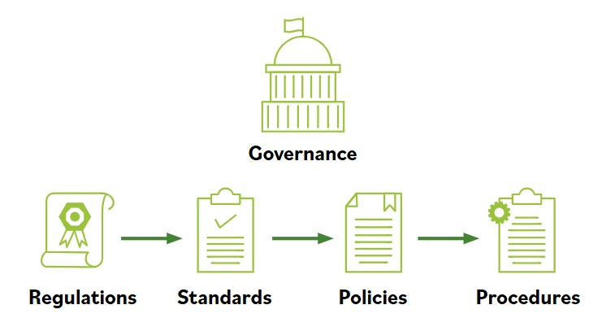

# Elementos de gobernanza

Toda empresa u organizacion existe para cumplir un proposito, ya sea proporcionar materias primas a una industria, fabricar equipos para construir hardware informatico, desarrollar aplicaciones de software, construir edificios o proporcionar bienes y servicios. Para completar el objetivo se requiere tomar decisiones, definir reglas y practicas, y contar con politicas y procedimientos que guien a la organizacion en la busqueda de sus metas y su mision.

**Cuando los lideres y la direccion implementan los sistemas y estructuras que la organizacion usara para alcanzar sus metas, se guian por leyes y regulaciones creadas por los gobiernos para aplicar politicas publicas. Las leyes y regulaciones guian el desarrollo de estandares, que cultivan politicas, que dan como resultado procedimientos.**

Como se relacionan las regulaciones, estandares, politicas y procedimientos? Puede ayudar observar la lista en orden inverso.

- Los procedimientos son los pasos detallados para completar una tarea que respaldan las politicas departamentales u organizacionales.
- Las politicas son establecidas por la gobernanza organizacional, como la direccion ejecutiva, para proporcionar orientacion en todas las actividades y asegurar que la organizacion respalde los estandares y regulaciones de la industria.
- Los estandares suelen ser utilizados por los equipos de gobernanza para proporcionar un marco que introduzca politicas y procedimientos en apoyo de las regulaciones.
- Las regulaciones se emiten comunmente en forma de leyes, normalmente por parte del gobierno (no debe confundirse con gobernanza), y suelen implicar sanciones financieras por incumplimiento.

### Regulaciones y leyes
**Las regulaciones y las multas y sanciones asociadas pueden ser impuestas por gobiernos a nivel nacional, regional o local.**

Debido a que las regulaciones y leyes pueden imponerse y aplicarse de manera diferente en distintas partes del mundo, aqui hay algunos ejemplos para conectar los conceptos con regulaciones reales.

La **Health Insurance Portability and Accountability Act (HIPAA)** de 1996 es un ejemplo de ley que regula el uso de protected health information (PHI), o informacion de salud protegida, en Estados Unidos. La violacion de HIPAA conlleva la posibilidad de multas y/o encarcelamiento tanto para personas como para companias.

El **General Data Protection Regulation (GDPR)** fue promulgado por la Union Europea (UE) para controlar el uso de Personally Identifiable Information (PII), o informacion de identificacion personal, de sus ciudadanos y de quienes se encuentran en la UE. Incluye disposiciones que aplican sanciones financieras a las companias que manejan datos de ciudadanos de la UE y de personas que viven en la UE, incluso si la compania no tiene presencia fisica en la UE, lo que da a esta regulacion un alcance internacional.

Finalmente, es comun estar sujeto a regulacion en varios niveles. Las organizaciones multinacionales estan sujetas a regulaciones en mas de una nacion, ademas de multiples regiones y municipios. Las organizaciones deben considerar las regulaciones que se aplican a su negocio en todos los niveles: nacional, regional y local, y asegurarse de cumplir con la regulacion mas restrictiva.

### Estandares
**Las organizaciones usan multiples estandares como parte de sus programas de seguridad de sistemas de informacion, tanto como documentos de cumplimiento como avisos o guias.**

Los estandares cubren una amplia gama de temas e ideas y pueden proporcionar garantia de que una organizacion opera con politicas y procedimientos que respaldan regulaciones y buenas practicas ampliamente aceptadas.

La **International Organization for Standardization (ISO)** desarrolla y publica estandares internacionales sobre diversos temas tecnicos, incluidos sistemas de informacion y seguridad de la informacion, asi como estandares de cifrado. ISO solicita aportes de la comunidad internacional de expertos antes de publicar sus estandares. Los documentos que describen estandares ISO pueden comprarse en linea.

El National Institute of Standards and Technology (NIST) es una agencia del gobierno de Estados Unidos dependiente del Departamento de Comercio, y publica diversos estandares tecnicos ademas de estandares de tecnologia de la informacion y seguridad de la informacion.

Muchos de los estandares emitidos por NIST son requisitos para agencias del gobierno de Estados Unidos y son considerados estandares recomendados por industrias de todo el mundo.

Los estandares de NIST solicitan e integran aportes de la industria y pueden descargarse gratuitamente desde el sitio web de NIST.

Finalmente, piensa en como las computadoras hablan con otras computadoras en todo el mundo. Las personas hablan distintos idiomas y no siempre se entienden entre si. Como pueden comunicarse las computadoras? A traves de estandares, por supuesto.

Gracias al **Internet Engineering Task Force (IETF)**, existen estandares en protocolos de comunicacion que aseguran que todas las computadoras puedan conectarse entre si a traves de fronteras, incluso cuando los operadores no hablan el mismo idioma.

El Institute of Electrical and Electronics Engineers (IEEE) tambien establece estandares para telecomunicaciones, ingenieria informatica y disciplinas similares.

### Politicas
La politica se basa en las leyes aplicables y especifica que estandares y guias seguira la organizacion. La politica es amplia, pero no detallada; establece el contexto y define la direccion estrategica y las prioridades. Las politicas de gobernanza se usan para moderar y controlar la toma de decisiones, asegurar el cumplimiento cuando sea necesario y guiar la creacion e implementacion de otras politicas.

Las politicas suelen redactarse en muchos niveles dentro de la organizacion. Las politicas de gobernanza de alto nivel son utilizadas por los altos ejecutivos para dar forma y controlar los procesos de toma de decisiones.

Otras politicas de alto nivel dirigen el comportamiento y la actividad de toda la organizacion mientras avanza hacia sus metas y objetivos. Las areas funcionales, como gestion de recursos humanos, finanzas y contabilidad, y seguridad y proteccion de activos, normalmente tienen sus propios conjuntos de politicas. Ya sea impuesta por leyes y regulaciones o por contratos, la necesidad de cumplimiento tambien puede requerir el desarrollo de politicas especificas de alto nivel que esten documentadas y evaluadas en cuanto a su uso efectivo por parte de la organizacion.

Las politicas son implementadas, o llevadas a cabo, por personas; para ello, alguien debe expandir las politicas desde declaraciones de intencion y direccion hasta instrucciones paso a paso, o procedimientos.

### Procedimientos
Los procedimientos definen las actividades explicitas y repetibles necesarias para realizar una tarea especifica o un conjunto de tareas. Proporcionan datos de apoyo, criterios de decision u otro conocimiento explicito necesario para ejecutar cada tarea. Los procedimientos pueden abordar acciones unicas o poco frecuentes, o sucesos comunes y regulares.

Ademas, los procedimientos establecen los criterios y metodos de medicion que deben usarse para determinar si una tarea se ha completado correctamente. Documentar adecuadamente los procedimientos y capacitar al personal sobre como localizarlos y seguirlos es necesario para obtener los maximos beneficios organizacionales de los procedimientos.
