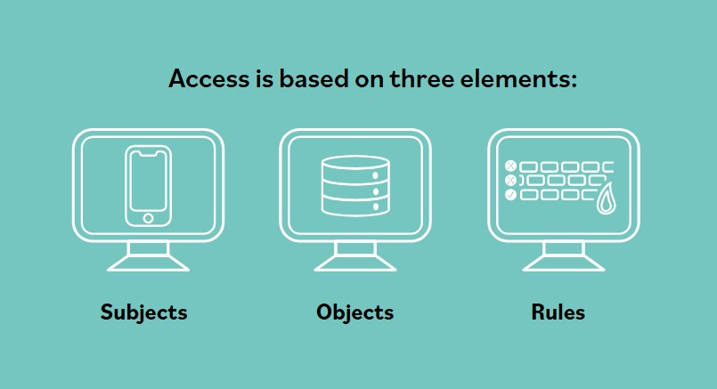

# Resumen de controles

Puede argumentarse que los controles de acceso son el corazon de un programa de seguridad de la informacion. Pero, al final, la seguridad se reduce a quien puede obtener acceso a los activos organizacionales (edificios, datos, sistemas, etc.) y que puede hacer cuando obtiene ese acceso.

Los controles de acceso no tratan solo de restringir el acceso a sistemas de informacion y datos, sino tambien de permitir el acceso. Se trata de conceder el nivel adecuado de acceso al personal y procesos autorizados, y de denegar el acceso a funciones o individuos no autorizados.

### Sujetos
**Un sujeto puede definirse como cualquier entidad que solicita acceso a activos.**

La entidad que solicita acceso puede ser, por ejemplo, un usuario, un cliente, un proceso o un programa. Un sujeto es quien inicia una solicitud de servicio; por lo tanto, se dice que un sujeto es "activo".

Un sujeto:
- Es un usuario, un proceso, un procedimiento, un cliente (o un servidor), un programa, o un dispositivo como un endpoint, estacion de trabajo, smartphone o dispositivo de almacenamiento extraible con firmware integrado.
- Es activo: inicia una solicitud de acceso a recursos o servicios.
- Solicita un servicio a un objeto.
- Debe tener un nivel de autorizacion (permisos) relacionado con su capacidad para acceder correctamente a servicios o recursos.

### Objetos
**Por definicion, cualquier cosa a la que un sujeto intenta acceder se denomina objeto.**

Un objeto es un dispositivo, proceso, persona, usuario, programa, servidor, cliente u otra entidad que responde a una solicitud de servicio. Mientras que un sujeto es activo porque inicia una solicitud de servicio, un objeto es pasivo porque no realiza ninguna accion hasta que un sujeto lo invoca. Cuando se le solicita, un objeto respondera a la solicitud que recibe y, si la solicitud es incorrecta, probablemente la respuesta tampoco sera lo que el sujeto realmente queria.

Observa que, por definicion, los objetos no contienen su propia logica de control de acceso. Los objetos son pasivos, no activos (en terminos de control de acceso), y deben protegerse contra accesos no autorizados mediante otras capas de funcionalidad del sistema, como el sistema integrado de gestion de identidades y accesos.

Un objeto tiene un propietario, y el propietario tiene derecho a determinar quien o que debe tener acceso a su objeto. Muy a menudo, las reglas de acceso se registran en una base de reglas o en una lista de control de acceso.

Un objeto:
- Es un edificio, una computadora, un archivo, una base de datos, una impresora o escaner, un servidor, un recurso de comunicaciones, un bloque de memoria, un puerto de entrada/salida, una persona, una tarea de software, un hilo o un proceso.
- Es cualquier cosa que proporciona servicio a un usuario.
- Es pasivo.
- Responde a una solicitud.
- Puede tener una clasificacion.

### Reglas
**Una regla de acceso es una instruccion desarrollada para permitir o denegar el acceso a un objeto comparando la identidad validada del sujeto con una lista de control de acceso.**

Un ejemplo de regla es una lista de control de acceso de firewall. Por defecto, los firewalls deniegan el acceso desde cualquier direccion hacia cualquier direccion, en cualquier puerto. Sin embargo, para que un firewall sea util, necesita mas reglas. Puede agregarse una regla para permitir acceso desde la red interna hacia la red externa. Aqui estamos describiendo una regla que permite el acceso al objeto "red externa" por parte del sujeto que tiene la direccion "red interna". En otro ejemplo, cuando un usuario (sujeto) intenta acceder a un archivo (objeto), una regla valida el nivel de acceso, si lo hay, que el usuario debe tener sobre ese archivo.

Para ello, la regla contendra o hara referencia a un conjunto de atributos que definen que nivel de acceso se ha determinado como apropiado.

Una regla puede:
- Comparar multiples atributos para determinar el acceso apropiado.
- Permitir acceso a un objeto.
- Definir cuanto acceso se permite.
- Denegar acceso a un objeto.
- Aplicar acceso basado en tiempo.
