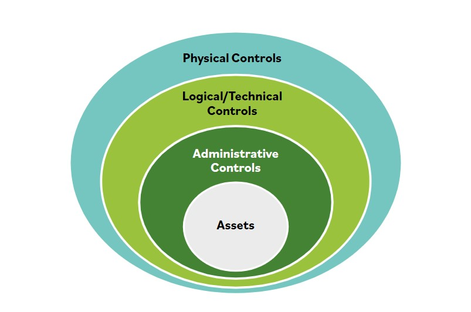

# Defensa en profundidad

Los permisos de acceso completo incluyen acceso a edificios, salas de servidores, redes, aplicaciones y utilidades. Todos estos son implementaciones de control de acceso y forman parte de una estrategia de defensa en capas, tambien conocida como defensa en profundidad, desarrollada por una organizacion.

La defensa en profundidad describe una estrategia de seguridad de la informacion que integra capacidades de personas, tecnologia y operaciones para establecer barreras variables en multiples capas y misiones de la organizacion.

Aplica multiples contramedidas en forma de capas para cumplir objetivos de seguridad. La defensa en profundidad debe implementarse para prevenir o disuadir un ciberataque, pero no puede garantizar que un ataque no ocurrira.

Un ejemplo tecnico de defensa en profundidad, en el que se implementan multiples capas de controles tecnicos, es cuando se requiere un nombre de usuario y contrasena para iniciar sesion en una cuenta, seguido de un codigo enviado al telefono del usuario para verificar su identidad. Esta es una forma de autenticacion multifactor que usa metodos en dos capas: algo que tienes y algo que sabes. La combinacion de las dos capas es mucho mas dificil de obtener para un adversario que cualquiera de los codigos de autenticacion por separado.

Otro ejemplo de multiples capas tecnicas es cuando se usan firewalls adicionales para separar redes no confiables con diferentes requisitos de seguridad, como internet, de redes confiables que alojan servidores con datos sensibles de la organizacion.

Cuando una compania tiene informacion en multiples niveles de sensibilidad, podria requerir que el trafico de red sea validado por reglas en mas de un firewall, con la informacion mas sensible almacenada detras de multiples firewalls.

Para un ejemplo no tecnico, considera las multiples capas de acceso necesarias para llegar a los datos reales en un centro de datos. Primero, una cerradura en la puerta proporciona una barrera fisica para acceder a los dispositivos de almacenamiento de datos.

Segundo, una regla tecnica de acceso impide el acceso a los datos a traves de la red. Finalmente, una politica o control administrativo define las reglas que asignan acceso a personas autorizadas.
