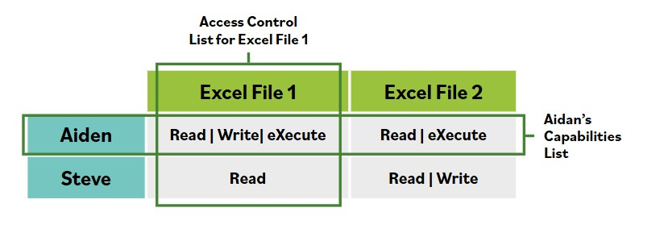

# Control de acceso discrecional (DAC)

**El control de acceso discrecional (DAC) es un tipo especifico de politica de control de acceso que se aplica sobre todos los sujetos y objetos en un sistema de informacion.**

En DAC, la politica especifica que un sujeto al que se le ha concedido acceso a informacion puede hacer una o mas de las siguientes acciones:
- Pasar la informacion a otros sujetos u objetos
- Conceder sus privilegios a otros sujetos
- Cambiar atributos de seguridad en sujetos, objetos, sistemas de informacion o componentes del sistema
- Elegir los atributos de seguridad que se asociaran con objetos recien creados o revisados
- Cambiar las reglas que gobiernan el control de acceso; los controles de acceso obligatorios restringen esta capacidad

## Ejemplo de DAC

Los sistemas de control de acceso discrecional permiten a los usuarios establecer o cambiar estos permisos sobre archivos que crean o de los que tienen propiedad.

Steve y Aidan, por ejemplo, son dos usuarios (sujetos) en un entorno UNIX que opera con DAC implementado. Normalmente, los sistemas crearan y mantendran una tabla que mapea sujetos a objetos, como se muestra en la imagen.

En cada interseccion se encuentra el conjunto de permisos que un sujeto determinado tiene para un objeto especifico.

Muchos sistemas operativos, como Windows y todo el arbol de la familia Unix (incluido Linux) e iOS, usan este tipo de estructura de datos para tomar decisiones rapidas y exactas sobre autorizar o denegar una solicitud de acceso. Observa que estos datos pueden verse como filas o como columnas:
- La lista de control de acceso de un objeto muestra el conjunto total de sujetos que tienen algun permiso para ese objeto especifico.
- La lista de capacidades de un sujeto muestra cada objeto del sistema sobre el que dicho sujeto tiene algun permiso.

Esta metodologia se basa en la discrecion del propietario del objeto de control de acceso para determinar los derechos especificos del sujeto de control de acceso. Por lo tanto, la seguridad del objeto queda literalmente a discrecion del propietario del objeto.

Los DAC no son muy escalables; dependen de las decisiones de control de acceso tomadas por cada propietario individual de objeto, y puede ser dificil encontrar la fuente de los problemas de control de acceso cuando ocurren.

### DAC en el lugar de trabajo

La mayoria de los sistemas de informacion son sistemas DAC. En un sistema DAC, un usuario que tiene acceso a un archivo puede compartir ese archivo con otra persona o pasarselo. Queda a discrecion del propietario del activo conceder o revocar acceso a un usuario. Para el acceso a archivos informaticos, esto puede hacerse mediante archivos compartidos o protecciones con contrasena.

Por ejemplo, si creas un archivo en una plataforma de intercambio de archivos en linea, puedes restringir quien lo ve. Eso queda a tu discrecion. DAC tambien puede ser de baja tecnologia y temporal, como una credencial de visitante proporcionada a discrecion del trabajador en el mostrador de seguridad.
