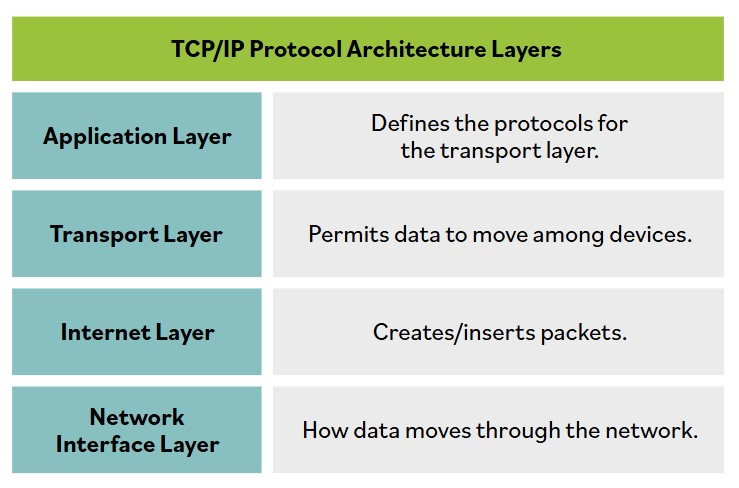
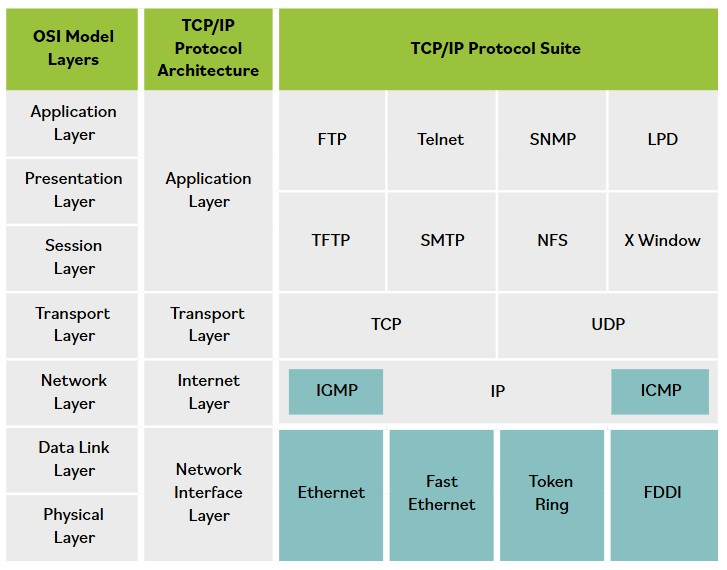

# Protocolo de Control de Transmision/Protocolo de Internet (TCP/IP)

**El modelo OSI no fue el primer ni el unico intento de simplificar los protocolos de red o establecer un estandar comun de comunicaciones.**

De hecho, el protocolo mas utilizado hoy, TCP/IP, se desarrollo a principios de la decada de 1970. El modelo OSI no se desarrollo hasta finales de la decada de 1970. La pila de protocolos TCP/IP se centra en las funciones principales de las redes.

La suite de protocolos mas utilizada es TCP/IP, pero no es un unico protocolo; mas bien, es una pila de protocolos que comprende decenas de protocolos individuales. TCP/IP es un protocolo independiente de la plataforma basado en estandares abiertos. Sin embargo, esto es tanto una ventaja como una desventaja. TCP/IP puede encontrarse en practicamente todos los sistemas operativos disponibles, pero consume una cantidad significativa de recursos y es relativamente facil de atacar porque fue disenado para facilidad de uso mas que para seguridad.

En la capa de aplicacion, los protocolos TCP/IP incluyen Telnet, File Transfer Protocol (FTP), Simple Mail Transport Protocol (SMTP) y Domain Name Service (DNS).

Los dos protocolos principales de la capa de transporte de TCP/IP son TCP y UDP. TCP es un protocolo full-duplex orientado a conexion, mientras que UDP es un protocolo simplex sin conexion. En la capa de internet, Internet Control Message Protocol (ICMP) se usa para determinar el estado de una red o de un enlace especifico. ICMP es utilizado por ping, traceroute y otras herramientas de gestion de red. La utilidad ping emplea paquetes ICMP echo y los hace rebotar en sistemas remotos. Por lo tanto, puedes usar ping para determinar si el sistema remoto esta en linea, si responde rapidamente, si los sistemas intermedios estan soportando las comunicaciones y el nivel de eficiencia de rendimiento con el que se comunican los sistemas intermedios.

