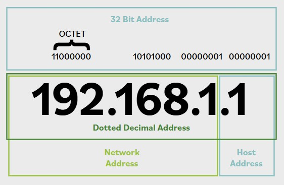
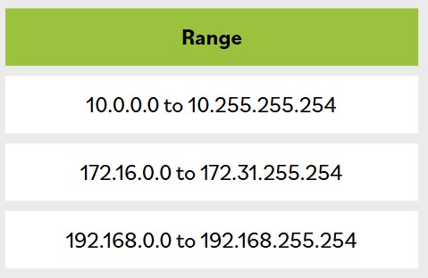

# Protocolo de Internet (IPv4 e IPv6)

**IP esta actualmente desplegado y se usa en todo el mundo en dos versiones principales. IPv4 proporciona un espacio de direcciones de 32 bits, que a finales de la decada de 1980 se proyectaba que se agotaria. IPv6 se introdujo en diciembre de 1995 y proporciona un espacio de direcciones de 128 bits junto con varias otras caracteristicas importantes.**

**Los hosts/dispositivos IP asocian una direccion con una direccion logica unica. Una direccion IPv4 se expresa como cuatro octetos separados por un punto (.), por ejemplo, 216.12.146.140.**

Cada octeto puede tener un valor entre 0 y 255. Sin embargo, 0 es la red misma (no un dispositivo en esa red), y 255 generalmente se reserva para fines de broadcast. Cada direccion se subdivide en dos partes: el numero de red y el host. El numero de red asignado por una organizacion externa, como Internet Corporation for Assigned Names and Numbers (ICANN), representa la red de la organizacion. El host representa la interfaz de red dentro de la red.

Para facilitar la administracion de red, las redes normalmente se dividen en subredes. Debido a que las subredes no pueden distinguirse con el esquema de direccionamiento tratado hasta ahora, se usa un mecanismo separado, la mascara de subred, para definir la parte de la direccion usada para la subred. La mascara suele convertirse a notacion decimal, como 255.255.255.0.

Con el numero cada vez mayor de computadoras y dispositivos en red, esta claro que IPv4 no proporciona suficientes direcciones para nuestras necesidades. Para superar esta limitacion, IPv4 se subdividio en rangos de direcciones publicas y privadas. Las direcciones publicas son limitadas con IPv4, pero este problema se abordo en parte con el direccionamiento privado. Las direcciones privadas pueden ser compartidas por cualquiera, y es muy probable que todos en tu calle esten usando el mismo esquema de direcciones.

La naturaleza del esquema de direccionamiento establecido por IPv4 hizo que los disenadores de redes empezaran a pensar en terminos de reutilizacion de direcciones IP. IPv4 facilito esto de varias maneras, como la creacion de grupos de direcciones privadas; esto permite que cada LAN en cada situacion de pequena oficina/oficina en casa (SOHO) use direcciones como 192.168.2.xxx para sus direcciones internas de red, sin temor a que otro sistema pueda interceptar trafico en su LAN.

**Esta tabla muestra las direcciones privadas disponibles para que cualquiera las use:**

El primer octeto de 127 esta reservado para la direccion de loopback de una computadora. Normalmente se usa la direccion 127.0.0.1. La direccion de loopback proporciona un mecanismo de autodiagnostico y resolucion de problemas a nivel de maquina. Este mecanismo permite a un administrador de red tratar una maquina local como si fuera remota y hacer ping a la interfaz de red para establecer si esta operativa.

IPv6 es una modernizacion de IPv4 que abordo varias debilidades del entorno IPv4:

- **Un campo de direccion mucho mas grande: las direcciones IPv6 son de 128 bits, lo que soporta 2^128 o 340,282,366,920,938,463,463,374,607,431,768,211,456 hosts. Esto asegura que no nos quedaremos sin direcciones.**

- **Seguridad mejorada: IPsec es una parte opcional de las redes IPv4, pero un componente obligatorio de las redes IPv6. Esto ayudara a asegurar la integridad y confidencialidad de los paquetes IP y permitira que los socios de comunicacion se autentiquen entre si.**

- **Calidad de servicio (QoS) mejorada: esto ayudara a que los servicios obtengan una proporcion apropiada del ancho de banda de una red.**

Una direccion IPv6 se muestra como ocho grupos de cuatro digitos. En lugar de digitos numericos (0-9) como IPv4, las direcciones IPv6 usan el rango hexadecimal (0000-ffff) y estan separadas por dos puntos (:) en lugar de puntos (.).

Un ejemplo de direccion IPv6 es 2001:0db8:0000:0000:0000:ffff:0000:0001. Para facilitar su lectura y escritura por humanos, puede acortarse eliminando los ceros iniciales al comienzo de cada campo y sustituyendo dos dos puntos (::) por los campos consecutivos de ceros mas largos. Todos los campos deben conservar al menos un digito. Despues de acortarla, la direccion de ejemplo anterior queda como 2001:db8::ffff:0:1, que es mucho mas facil de escribir.

Como en IPv4, hay algunas direcciones y rangos reservados para usos especiales:

- ::1 es la direccion local de loopback, usada igual que 127.0.0.1 en IPv4.

- El rango 2001:db8:: a 2001:db8:ffff:ffff:ffff:ffff:ffff:ffff esta reservado para uso en documentacion, igual que en los ejemplos anteriores. fc00:: a fdff:ffff:ffff:ffff:ffff:ffff:ffff:ffff son direcciones reservadas para uso de red interna y no son enrutables en internet.
