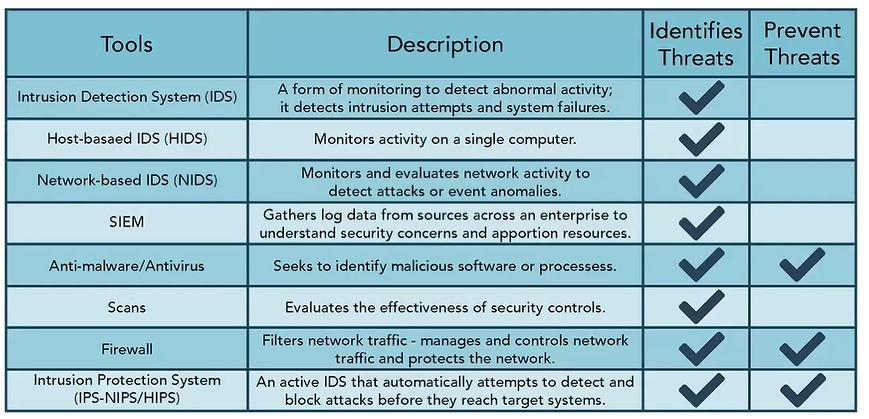

# Herramientas para identificar y prevenir amenazas

Esta tabla enumera herramientas usadas para identificar amenazas que pueden ayudar a proteger contra muchos tipos de ataques, como virus y malware, ataques de denegacion de servicio, spoofing, ataques on-path y ataques de canal lateral. Desde monitorear actividad en una sola computadora, como con HIDS, hasta recopilar datos de logs, como con SIEM, y filtrar trafico de red, como con firewalls, estas herramientas ayudan a proteger redes completas y sistemas individuales. Estas herramientas, que cubriremos con mas profundidad, ayudan a identificar amenazas potenciales. Las herramientas anti-malware, firewall y sistema de prevencion de intrusiones tambien tienen la capacidad adicional de prevenir amenazas.

<video controls preload="metadata" width="100%">
  <source src="video/13.ligero.mp4" type="video/mp4">
  <track src="video/subtitles/13.vtt" kind="subtitles" srclang="en" label="English">
  <track src="video/subtitles/13_es.vtt" kind="subtitles" srclang="es" label="Español" default>
  Tu navegador no soporta la reproduccion de video.
</video>

