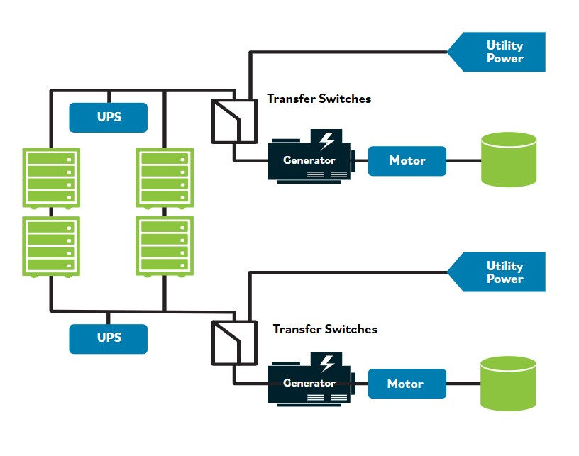

# Ejemplo de redundancia (aplicacion)

Ademas de mantener respaldos redundantes de la informacion, tambien tienes una fuente de energia redundante para proporcionar energia de respaldo. Asi, tienes una fuente de alimentacion ininterrumpida o UPS; tambien pueden estar involucrados interruptores de transferencia o transformadores. En caso de que la energia se interrumpa por clima o apagones, un generador de respaldo es esencial.

<video controls preload="metadata" width="100%">
  <source src="video/20.ligero.mp4" type="video/mp4">
  <track src="video/subtitles/20.vtt" kind="subtitles" srclang="en" label="English">
  <track src="video/subtitles/20_es.vtt" kind="subtitles" srclang="es" label="Español" default>
  Tu navegador no soporta la reproduccion de video.
</video>

A menudo habra dos generadores conectados mediante dos interruptores de transferencia diferentes. Estos generadores podrian funcionar con diesel o gasolina, u otro combustible como propano, o incluso con paneles solares. Un hospital o una agencia gubernamental esencial podria contratar con mas de una compania electrica y estar en dos redes electricas diferentes. En caso de que una falle, esto es lo que queremos decir con redundancia.
