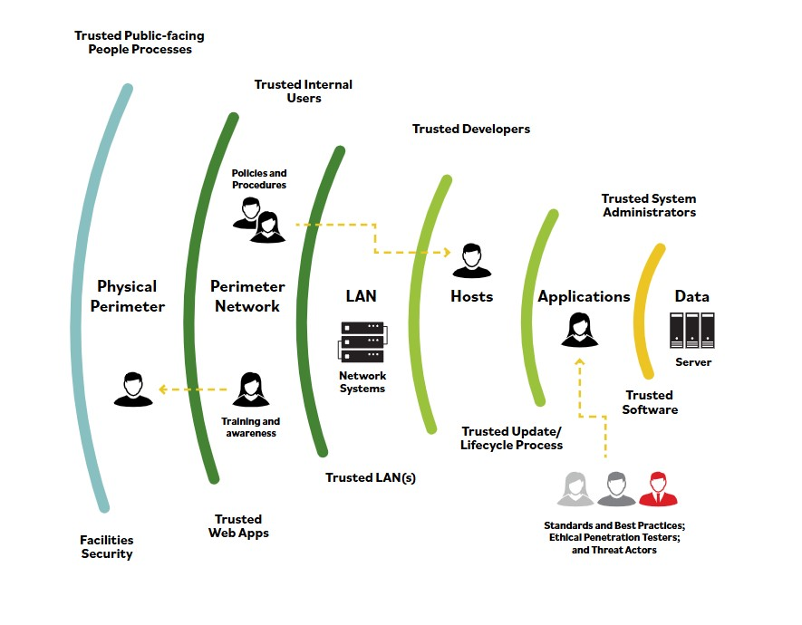

# Defensa en profundidad

**La defensa en profundidad usa un enfoque por capas al disenar la postura de seguridad de una organizacion.**

Piensa en un castillo que guarda las joyas de la corona. Las joyas se colocaran en una camara acorazada en una ubicacion central vigilada por guardias de seguridad. El castillo se construye alrededor de la boveda con capas adicionales de seguridad: soldados, muros y un foso.

El mismo enfoque aplica al disenar la seguridad logica de una instalacion o sistema. Usar capas de seguridad disuadira a muchos atacantes y los animara a enfocarse en otros objetivos mas faciles.

La defensa en profundidad proporciona mas bien un punto de partida para considerar todos los tipos de controles, administrativos, tecnologicos y fisicos, que permiten que personas internas y operadores trabajen juntos para proteger su organizacion y sus sistemas.

### Estos son algunos ejemplos que explican mejor el concepto de defensa en profundidad:

- **Datos:** Controles que protegen los datos reales con tecnologias como cifrado, prevencion de fuga de datos, gestion de identidades y accesos, y controles de datos.
- **Aplicacion:** Controles que protegen la aplicacion con tecnologias como prevencion de fuga de datos, firewalls de aplicacion y monitores de bases de datos.
- **Host:** Todo control colocado a nivel de endpoint, como antivirus, firewall de endpoint, configuracion y gestion de parches.
- **Perimetro:** Controles que protegen contra acceso no autorizado a la red. Este nivel incluye el uso de tecnologias como firewalls de gateway, honeypots, analisis de malware y zonas desmilitarizadas (DMZ) seguras.
- **Red interna:** Controles implementados para proteger contra flujo de datos no controlado y acceso de usuarios a traves de la red organizacional. Las tecnologias relevantes incluyen sistemas de deteccion de intrusiones, sistemas de prevencion de intrusiones, firewalls internos y controles de acceso a la red.
- **Fisico:** Controles que proporcionan una barrera fisica, como cerraduras, muros o control de acceso.
- **Politicas, procedimientos y concienciacion:** Controles administrativos que reducen amenazas internas (intencionales y no intencionales) e identifican riesgos tan pronto como aparecen.

