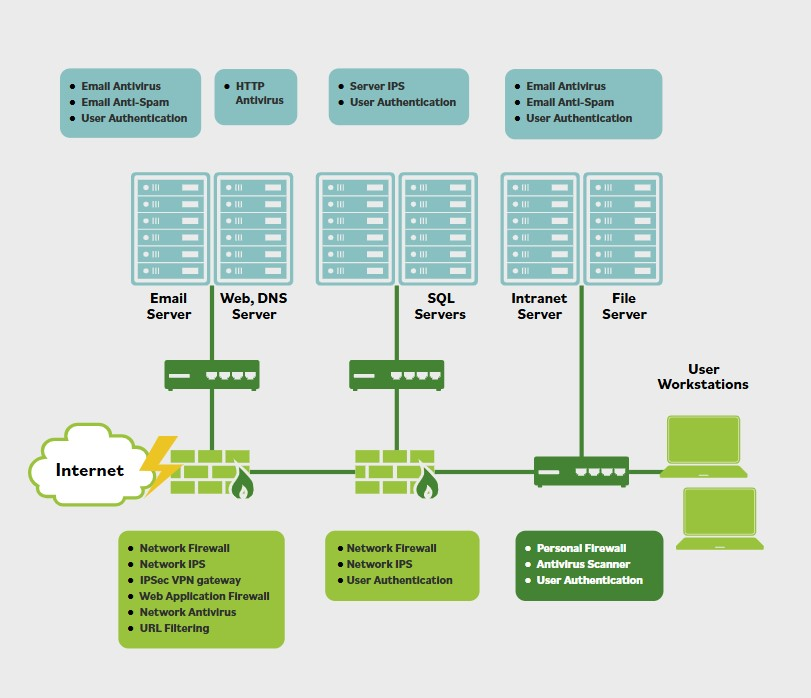

# Zero Trust

**Las redes Zero Trust suelen ser redes microsegmentadas, con firewalls en casi todos los puntos de conexion. Zero Trust encapsula los activos de informacion, los servicios que se aplican a ellos y sus propiedades de seguridad.**

Este concepto reconoce que, una vez dentro de un entorno de confiar-pero-verificar, un usuario puede tener capacidades practicamente ilimitadas para moverse, identificar activos y sistemas, y potencialmente encontrar vulnerabilidades explotables. Colocar un mayor numero de firewalls u otros dispositivos de control de frontera de seguridad en toda la red aumenta el numero de oportunidades para detectar a un actor problematico antes de que cause dano. Muchas arquitecturas empresariales llevan esto al extremo de microsegmentar sus redes internas, lo que impone reautenticacion frecuente de un ID de usuario, como se muestra en esta imagen.

**Considera un concierto de musica rock. Si se emplean controles perimetrales tradicionales, como firewalls, mostrarias tu entrada en la puerta y tendrias acceso libre al recinto, incluido el backstage donde estan las verdaderas estrellas.**

En un entorno Zero Trust, se agregan puntos de control adicionales. Tu identidad (entrada) se valida para acceder a los asientos de pista y nuevamente para acceder al area backstage. Tus credenciales deben ser validas en los tres niveles para conocer a las estrellas del espectaculo.

Zero Trust es un enfoque de diseno en evolucion que reconoce que incluso los sistemas de control de acceso mas robustos tienen debilidades. Agrega defensas a nivel de usuario, activo y datos, en lugar de depender de la defensa perimetral. En el extremo, insiste en que cada proceso o accion que un usuario intenta realizar debe autenticarse y autorizarse; la ventana de confianza se vuelve extremadamente pequena.

Mientras que la microsegmentacion agrega perimetros internos, Zero Trust coloca el foco en los activos, o datos, en lugar del perimetro. Zero Trust construye puertas mas efectivas para proteger directamente los activos, en lugar de construir muros adicionales o mas altos.
