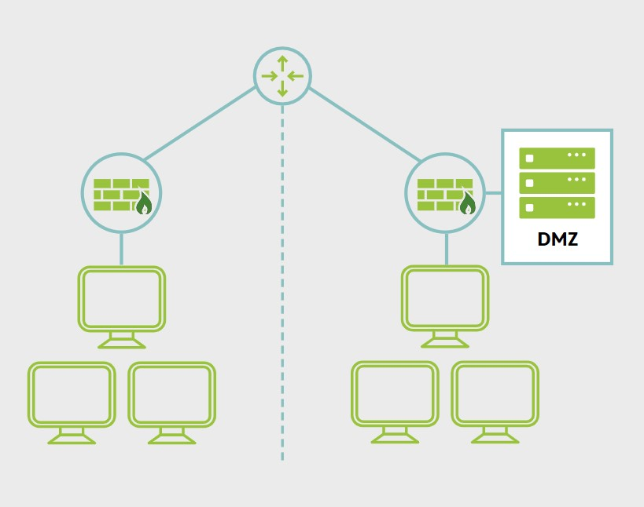

# Segmentacion de red: Demilitarized Zone (DMZ)

**La segmentacion de red es una forma eficaz de lograr defensa en profundidad para aplicaciones distribuidas o multicapa. El uso de una demilitarized zone (DMZ), por ejemplo, es una practica comun en arquitectura de seguridad.**

Con una DMZ, los sistemas host que son accesibles a traves del firewall estan separados fisicamente de la red interna mediante switches asegurados o mediante el uso de un firewall adicional para controlar el trafico entre el servidor web y la red interna. Las DMZ de aplicaciones (o redes semiconfiables) se usan frecuentemente hoy para limitar el acceso a servidores de aplicaciones solo a aquellas redes o sistemas que tienen una necesidad legitima de conectarse.

