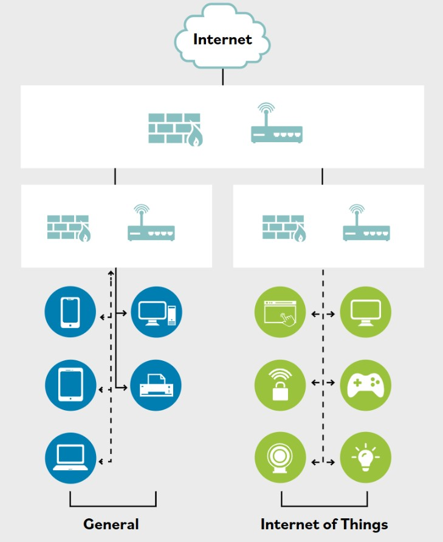

# Segmentacion para sistemas embebidos e IoT

**Un sistema embebido es una computadora implementada como parte de un sistema mas grande. El sistema embebido normalmente se disena alrededor de un conjunto limitado de funciones especificas en relacion con el producto mas grande del que es componente.**

Ejemplos de sistemas embebidos incluyen impresoras conectadas a red, smart TVs, controles HVAC, electrodomesticos inteligentes, termostatos inteligentes y dispositivos medicos.

Los dispositivos con capacidad de red son cualquier tipo de dispositivo portatil o no portatil que tiene capacidades nativas de red. Esto generalmente asume que la red en cuestion es de tipo inalambrico, normalmente proporcionada por una compania de telecomunicaciones moviles. Los dispositivos con capacidad de red incluyen smartphones, telefonos moviles, tablets, smart TVs o reproductores de medios en streaming (por ejemplo, Roku Player, Amazon Fire TV, Google Android TV/Chromecast), impresoras conectadas a red, sistemas de juego y mas.

El Internet of Things (IoT) es la coleccion de dispositivos que pueden comunicarse por internet entre si o con una consola de control para afectar y monitorear el mundo real. Los dispositivos IoT pueden etiquetarse como dispositivos inteligentes o equipos de hogar inteligente. Muchas de las ideas de control ambiental industrial encontradas en edificios de oficinas estan llegando a soluciones mas disponibles para consumidores en pequenas oficinas o hogares personales.

Los sistemas embebidos y dispositivos con capacidad de red que se comunican con internet se consideran dispositivos IoT y necesitan atencion especial para asegurar que la comunicacion no se use de manera maliciosa.

Debido a que un sistema embebido a menudo controla un mecanismo en el mundo fisico, una brecha de seguridad podria causar dano a personas y propiedad. Como muchos de estos dispositivos tienen multiples rutas de acceso, como ethernet, inalambrico o Bluetooth, debe tenerse especial cuidado para aislarlos de otros dispositivos en la red. Puedes imponer segmentacion logica de red con switches usando VLANs, o mediante otros medios de control de trafico, incluidas direcciones MAC, direcciones IP, puertos fisicos, protocolos, filtrado de aplicaciones, enrutamiento y gestion de control de acceso. La segmentacion de red puede usarse para aislar entornos IoT.

