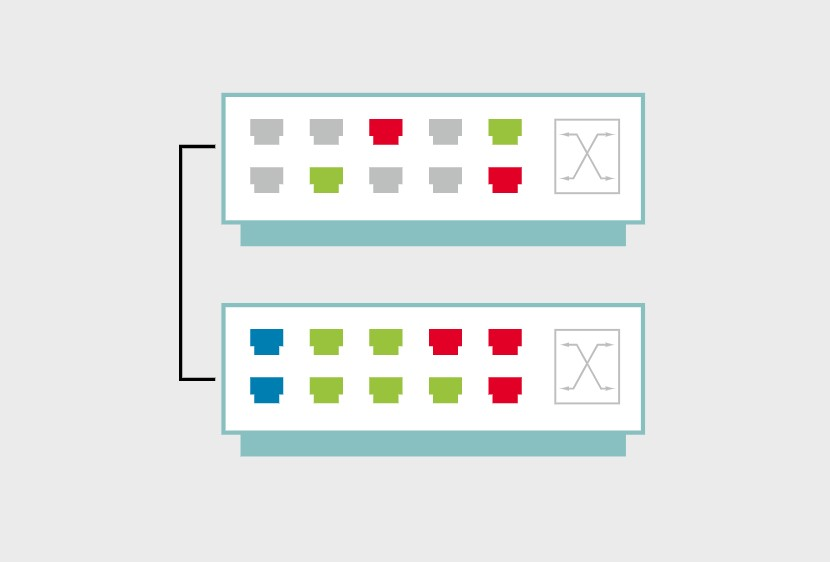

# Red de area local virtual (VLAN)

**Las virtual local area networks (VLANs), o redes de area local virtuales, permiten a los administradores de red usar switches para crear segmentos LAN basados en software, que pueden segregar o consolidar trafico a traves de multiples puertos de switch.**

Los dispositivos que comparten una VLAN se comunican a traves de switches como si estuvieran en la misma red de Capa 2. La imagen siguiente muestra diferentes VLANs, roja, verde y azul, conectando conjuntos separados de puertos, mientras comparten el mismo segmento de red compuesto por los dos switches y su conexion.

Como las VLAN actuan como redes discretas, las comunicaciones entre VLANs deben habilitarse. El trafico de broadcast se limita a la VLAN, reduciendo congestion y reduciendo la efectividad de algunos ataques. La administracion del entorno se simplifica, ya que las VLANs pueden reconfigurarse cuando las personas cambian su ubicacion fisica o necesitan acceso a diferentes servicios. Las VLANs pueden configurarse basandose en puerto de switch, subred IP, direccion MAC y protocolos.

Las VLANs no garantizan la seguridad de una red. A primera vista, puede parecer que el trafico no puede interceptarse porque la comunicacion dentro de una VLAN esta restringida a dispositivos miembros. Sin embargo, hay ataques que permiten a un usuario malicioso ver trafico de otras VLANs (el llamado "VLAN hopping"). La tecnologia VLAN es solo una herramienta que puede mejorar la seguridad general del entorno de red.

