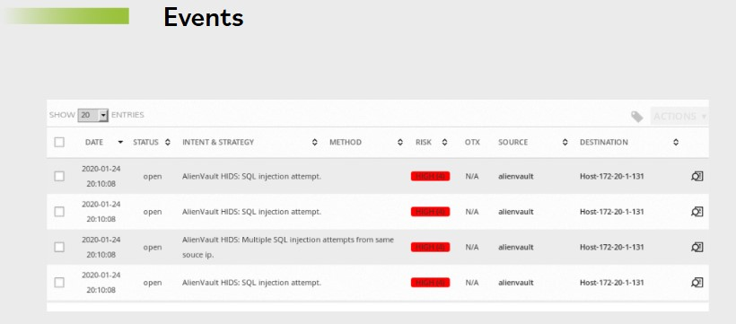
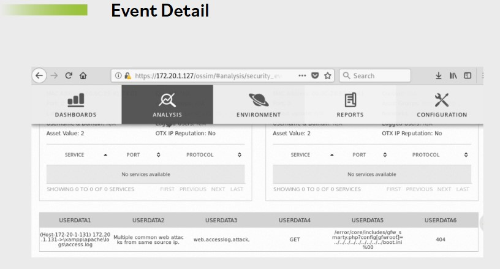
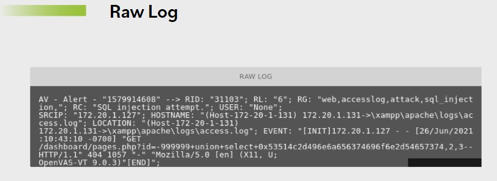

# Logging y monitoreo de eventos de seguridad

**El logging es la forma principal de instrumentacion que intenta capturar senales generadas por eventos.**

**Los eventos son cualquier accion que ocurre dentro del entorno de sistemas y causa un cambio medible u observable en uno o mas elementos o recursos del sistema.**

El logging impone un costo computacional, pero es invaluable al determinar la rendicion de cuentas. El diseno adecuado de entornos de logging y las revisiones regulares de logs siguen siendo buenas practicas independientemente del tipo de sistema informatico.

Los principales marcos de controles enfatizan la importancia de las practicas organizacionales de logging.

La informacion que puede ser relevante registrar y revisar incluye, entre otras cosas:

- ID de usuario
- Actividades del sistema
- Fechas y horas de eventos clave, por ejemplo logon y logoff
- Identidad del dispositivo y ubicacion
- Intentos exitosos y rechazados de acceso a sistemas y recursos
- Cambios de configuracion del sistema y eventos de activacion y desactivacion de la proteccion del sistema

Registrar y monitorear la salud del entorno de informacion es esencial para identificar sistemas ineficientes o con funcionamiento incorrecto, detectar compromisos y proporcionar un registro de como se usan los sistemas.

**Las practicas robustas de logging proporcionan herramientas para correlacionar eficazmente informacion de sistemas diversos y comprender por completo la relacion entre una actividad y otra.**

Las revisiones de logs son una funcion esencial no solo para la evaluacion y pruebas de seguridad, sino tambien para identificar incidentes de seguridad, violaciones de politicas, actividades fraudulentas y problemas operativos cerca del momento en que ocurren. Las revisiones de logs apoyan auditorias, analisis forense relacionado con investigaciones internas y externas, y proporcionan soporte para las baselines de seguridad organizacionales. La revision de logs historicos de auditoria puede determinar si una vulnerabilidad identificada en un sistema fue explotada previamente.

Es util que una organizacion cree componentes de una infraestructura de gestion de logs y determine como interactuan esos componentes. Esto ayuda a preservar la integridad de los datos de log frente a modificacion o eliminacion accidental o intencional, y a mantener la confidencialidad de los datos de log.

Se implementan controles para proteger contra cambios no autorizados en la informacion de logs. Los problemas operativos con la facilidad de logging suelen estar relacionados con alteraciones en los mensajes registrados, archivos de log editados o eliminados, y superacion de la capacidad de almacenamiento de los medios de archivos de log. Las organizaciones deben mantener la adherencia a la politica de retencion para logs segun lo prescrito por leyes, regulaciones y gobierno corporativo. Dado que los atacantes quieren ocultar la evidencia de su ataque, las politicas y procedimientos de la organizacion tambien deben abordar la preservacion de los logs originales. Ademas, los logs contienen informacion valiosa y sensible sobre la organizacion. Deben tomarse medidas apropiadas para proteger los datos de log contra uso malicioso.

