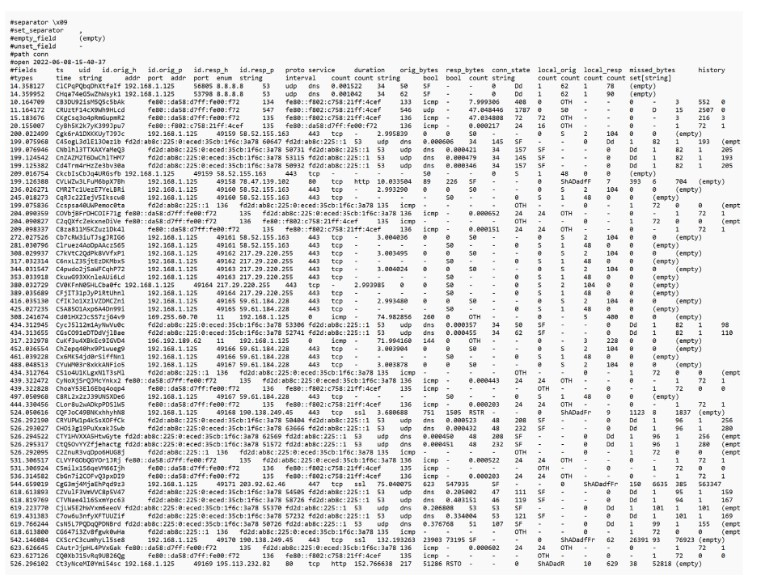

# Ejemplo de evento de seguridad de datos

**Este es un ejemplo de evento de seguridad de datos. Es un log sin procesar y es una forma de ver si alguien intento entrar en un archivo seguro y secuestrar el servidor.**

Por supuesto, ahora existen otros sistemas que son mas faciles de usar. Pero los ingenieros de seguridad se familiarizan con algunos de estos codigos y pueden averiguar exactamente quien intentaba iniciar sesion, si se trataba de un puerto seguro o de un puerto cuestionable que intentaban usar para penetrar nuestro sitio.

La seguridad de la informacion no es algo que se enchufa segun sea necesario. Se pueden aplicar parches a un sistema que ya existe, como actualizaciones, pero si no se tiene un sistema seguro, no se puede simplemente conectar algo para protegerlo. Desde el principio se debe planificar esa seguridad, incluso antes de que los datos se introduzcan en la red.

