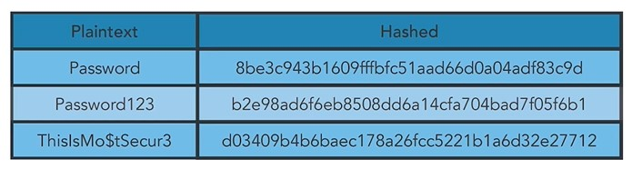

# Como funcionan las contrasenas

Con frecuencia, una contrasena se almacenara como un valor hash fijo o digest. Asi, el sistema puede saber si la contrasena coincide sin que la propia contrasena sea visible. Una contrasena mas segura, con caracteres alfanumericos y especiales, generara un digest hash diferente. Sin embargo, este sistema de gestion de contrasenas ya esta quedando obsoleto. A menudo, por motivos de seguridad, se le pedira que genere una nueva contrasena con un numero minimo de caracteres, y el software subyacente reconocera la funcion hash e indicara si la contrasena es suficientemente segura para usarse o le solicitara crear una mejor. Los atacantes pueden usar hashes de contrasenas para adivinar contrasenas sin conexion. Si un atacante puede copiar el archivo de contrasenas, que normalmente esta hasheado, desde una estacion de trabajo o servidor comprometido, y conoce el algoritmo usado para hashear la contrasena, puede usar una computadora para probar secuencias aleatorias de letras y combinaciones de numeros hasta intentar coincidir con el hash de contrasena conocido.
