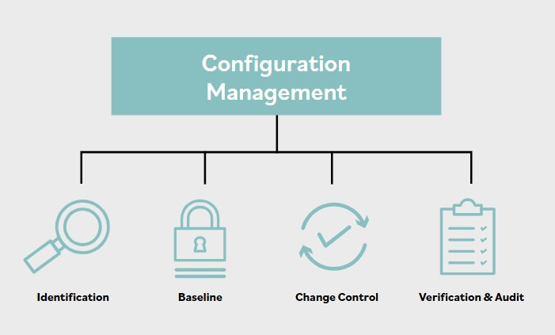

# Resumen de gestion de configuracion

**La gestion de configuracion es un proceso y una disciplina que se utilizan para garantizar que los unicos cambios realizados en un sistema sean aquellos que han sido autorizados y validados.**

Es tanto un proceso de toma de decisiones como un conjunto de procesos de control. Si observamos esta definicion con mas detalle, el proceso basico de gestion de configuracion incluye componentes como identificacion, baselines, actualizaciones y parches.

- **Identificacion**

Identificacion de la baseline de un sistema y de todos sus componentes, interfaces y documentacion.

- **Baseline**

Una baseline de seguridad es un nivel minimo de proteccion que puede usarse como punto de referencia. Las baselines proporcionan una forma de garantizar que las actualizaciones de tecnologia y arquitecturas esten sujetas al nivel minimo entendido y aceptable de requisitos de seguridad.

- **Control de cambios**

Un proceso de actualizacion para solicitar cambios a una baseline mediante modificaciones en uno o mas componentes de esa baseline. Incluye un proceso de revision y aprobacion para todos los cambios, incluidas actualizaciones y parches.

- **Verificacion y auditoria**

Un proceso de regresion y validacion, que puede implicar pruebas y analisis, para verificar que nada en el sistema se haya roto por un conjunto de cambios aplicado recientemente. Un proceso de auditoria puede validar que la baseline actualmente en uso coincida con la suma total de su baseline inicial mas todos los cambios aprobados aplicados en secuencia.

### Inventario

Crear un inventario, catalogo o registro de todos los activos de informacion que la organizacion conoce, ya existan o formen parte de una lista de deseos o de una necesidad de crear o adquirirlos, es el primer paso en cualquier proceso de gestion de activos. Requiere localizar e identificar todos los activos de interes, incluidos, y especialmente, los activos de informacion: **no se puede proteger lo que no se sabe que se tiene.**

Mantener ese inventario, junto con su salud y estado respecto a actualizaciones y parches, de forma consistente y actual dia tras dia se vuelve aun mas desafiante. De hecho, es muy dificil identificar cada host fisico y endpoint, y todavia mas recopilar los datos de todos ellos.

### Baselines

Un producto de software comercial, por ejemplo, podria tener miles de modulos individuales, procesos, parametros, archivos de inicializacion u otros elementos. Si falta cualquiera de ellos, el sistema no puede funcionar correctamente. La baseline es un inventario total de todos los componentes del sistema: hardware, software, datos, controles administrativos, documentacion e instrucciones de usuario.

Una vez que existen controles para mitigar riesgos, las baselines pueden usarse como referencia. Todas las comparaciones y desarrollos posteriores se miden contra las baselines.

Al proteger activos, las baselines pueden ser especialmente utiles para alcanzar un nivel minimo de proteccion de esos activos basado en su valor. Recuerde que, si los activos se han clasificado segun su valor y se han establecido baselines significativas para cada nivel de clasificacion, podemos ajustarnos a los niveles minimos requeridos. En otras palabras, si se usan clasificaciones como alta, media y baja, podrian desarrollarse baselines para cada clasificacion y proporcionar el nivel minimo de seguridad requerido para cada una.

### Actualizaciones

Las reparaciones, acciones de mantenimiento y actualizaciones se requieren con frecuencia en casi todos los niveles de los elementos de sistemas, desde la infraestructura basica de la arquitectura de TI hasta los sistemas operativos, plataformas de aplicaciones, redes e interfaces de usuario. Tales modificaciones deben someterse a pruebas de aceptacion para verificar que la funcionalidad recien instalada o reparada funciona segun lo requerido.

Tambien deben someterse a pruebas de regresion para verificar que las modificaciones no introdujeron otros comportamientos erroneos o inesperados en el sistema. Las pruebas continuas de evaluacion y valoracion de seguridad determinan si el mismo sistema que paso las pruebas de aceptacion sigue siendo seguro.

### Parches

La gestion de parches se aplica principalmente a software y dispositivos de hardware sujetos a modificaciones regulares. Un parche es una actualizacion, mejora o modificacion de un sistema o componente. Estos parches pueden ser necesarios para abordar una vulnerabilidad o mejorar la funcionalidad. El desafio para el profesional de seguridad es mantener todos los parches, ya que pueden llegar en intervalos irregulares desde muchos proveedores diferentes. Algunos parches son criticos y deben desplegarse rapidamente, mientras que otros pueden no ser tan criticos, pero aun asi deben desplegarse porque parches posteriores pueden depender de ellos. Estandares como PCI DSS requieren que las organizaciones desplieguen parches de seguridad dentro de un plazo determinado.

Existen algunos problemas con el uso de parches. Muchas organizaciones se han visto afectadas por un parche defectuoso de un proveedor reputado que afecto la funcionalidad del sistema. Por lo tanto, una organizacion debe probar el parche antes de implementarlo en toda la organizacion. Esto suele complicarse por la falta de un entorno de pruebas que coincida con el entorno de produccion. Pocas organizaciones tienen el presupuesto para mantener un entorno de pruebas que sea una copia exacta de produccion.

Siempre existe el riesgo de que no se pruebe todo y de que aparezcan problemas en produccion que no eran evidentes en el entorno de pruebas. En la medida de lo posible, los parches deben probarse para garantizar que funcionaran correctamente en produccion.

Si el parche no funciona o tiene efectos inaceptables, puede ser necesario hacer rollback a un estado anterior, previo al parche. Normalmente, los criterios para rollback se documentan previamente y el rollback se realizaria automaticamente cuando se cumplieran esos criterios.

Muchos proveedores ofrecen una solucion de gestion de parches para sus productos. Estos sistemas suelen tener ciertos procesos automatizados, o actualizaciones desatendidas, que permiten parchear sistemas sin interaccion del administrador. El riesgo de usar parcheo desatendido debe compararse con el riesgo de tener sistemas sin parchar en la red de la organizacion. El parcheo desatendido, o automatizado, puede provocar interrupciones no programadas cuando los sistemas de produccion se desconectan o se reinician como parte del proceso de parcheo.
