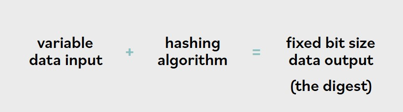
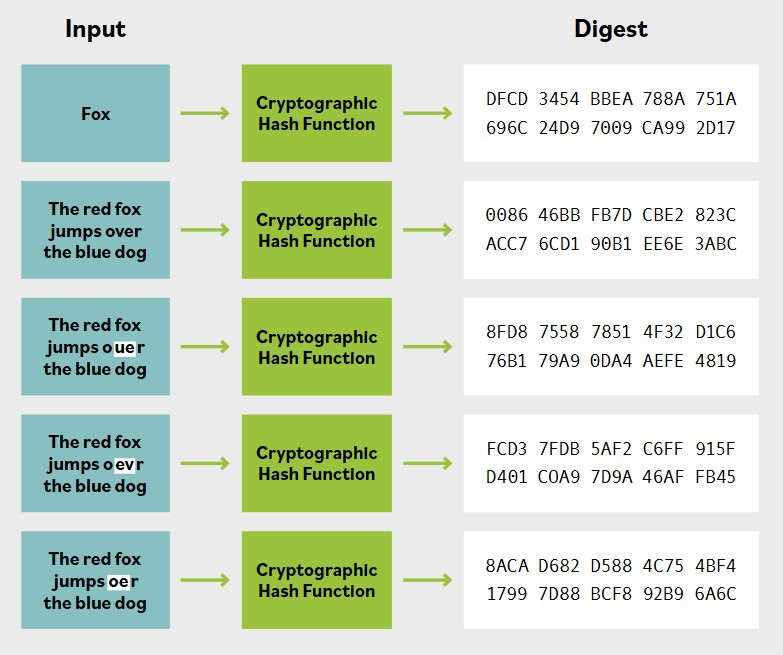

# Hashing

**El hashing toma un conjunto de datos de entrada de tamano casi arbitrario y devuelve un resultado de longitud fija llamado valor hash. Una funcion hash es el algoritmo usado para realizar esta transformacion. Cuando se usa con algoritmos hash criptograficamente fuertes, este es hoy el metodo mas comun para garantizar la integridad de mensajes.**

**Los hashes tienen muchos usos en computacion y seguridad; uno de ellos es crear un digest de mensaje aplicando una funcion hash de este tipo al cuerpo en texto claro de un mensaje.**

Para ser util y segura, una funcion hash criptografica debe demostrar cinco propiedades principales:

- **Util:** es facil calcular el valor hash para cualquier mensaje dado.

- **No reversible:** es computacionalmente inviable revertir el proceso hash o derivar de otro modo el texto claro original de un mensaje a partir de su valor hash, a diferencia de un proceso de cifrado, para el cual debe existir un proceso de descifrado correspondiente.

- **Garantia de integridad del contenido:** es computacionalmente inviable modificar un mensaje de tal forma que, al volver a aplicar la funcion hash, se produzca el valor hash original.

- **Unico:** es computacionalmente inviable encontrar dos o mas mensajes diferentes y coherentes que produzcan el mismo valor hash.

- **Deterministico:** la misma entrada siempre generara el mismo hash cuando se use el mismo algoritmo de hashing.

**Las funciones hash criptograficas tienen muchas aplicaciones en seguridad de la informacion, incluidas firmas digitales, codigos de autenticacion de mensajes y otras formas de autenticacion.**

Tambien pueden usarse para fingerprinting, para identificar datos duplicados o identificar archivos de forma unica, y como checksums para detectar corrupcion accidental de datos. La operacion de un algoritmo de hashing se muestra en la imagen siguiente.

Este es un ejemplo de una funcion de hashing simple. El originador quiere enviar un mensaje al receptor y asegurarse de que el mensaje no sea alterado por ruido o paquetes perdidos durante la transmision. El originador pasa el mensaje por un algoritmo de hashing que genera un hash, o digest del mensaje.

El digest se anexa al mensaje y se envia junto con el mensaje al destinatario. Una vez entregado el mensaje, el receptor generara su propio digest del mensaje recibido usando el mismo algoritmo de hashing. El digest del mensaje recibido se compara con el digest enviado por el originador. Si los digests son iguales, el mensaje recibido es el mismo que el mensaje enviado.

El problema con una funcion hash simple como esta es que no protege contra un atacante malicioso que podria cambiar tanto el mensaje como el hash o digest al interceptarlos en transito. La idea general de una funcion hash criptografica puede resumirse con la siguiente formula:

Como se ve en esta imagen, incluso el cambio mas pequeno en el mensaje de entrada produce un valor hash completamente diferente.

Las funciones hash son sensibles a cualquier cambio en el mensaje. Debido a que el tamano del digest hash no varia segun el tamano del mensaje, una persona no puede saber el tamano del mensaje basandose en el digest.

