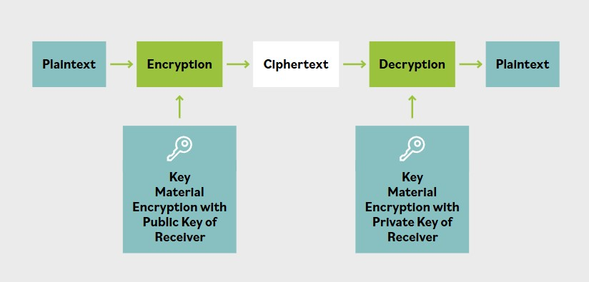

# Cifrado asimetrico

**El cifrado asimetrico usa una clave para cifrar y una clave diferente para descifrar el texto claro de entrada. Esto contrasta claramente con el cifrado simetrico, que usa la misma clave para cifrar y descifrar.**

**Para la mayoria de los profesionales de seguridad, las matematicas del cifrado asimetrico pueden dejarse a los criptoanalistas y criptografos.**

Un usuario que desea comunicarse usando un algoritmo asimetrico primero generaria un par de claves. Para garantizar la fortaleza del proceso de generacion de claves, esto suele hacerlo la aplicacion criptografica o la implementacion de infraestructura de clave publica (PKI) sin intervencion del usuario. Una mitad del par de claves se mantiene secreta; solo el titular de la clave conoce esa clave. Por eso se llama clave privada. La otra mitad del par de claves puede entregarse libremente a cualquiera que quiera una copia. En muchas empresas, puede estar disponible a traves del sitio web corporativo o mediante acceso a un servidor de claves. Por lo tanto, esta segunda mitad del par de claves se denomina clave publica.

Tenga en cuenta que cualquiera puede cifrar algo usando la clave publica del destinatario, pero solo el destinatario, con su clave privada, puede descifrarlo.

La criptografia de clave asimetrica resuelve el problema de distribucion de claves al permitir que un mensaje se envie a traves de un medio no confiable de forma segura, sin la sobrecarga de un intercambio previo de claves o distribucion de material criptografico. Tambien permite varias otras caracteristicas que no estan facilmente disponibles en la criptografia simetrica, como el no repudio de origen y entrega, el control de acceso y la integridad de datos.

La criptografia de clave asimetrica tambien resuelve el problema de escalabilidad. Escala bien a medida que aumentan los numeros, ya que cada parte solo requiere un par de claves: la clave privada y la clave publica. Una organizacion con 100,000 empleados solo necesitaria un total de 200,000 claves, una privada y una publica por cada empleado. Esto es menos de la mitad del numero de claves que se requeririan para cifrado simetrico segun el planteamiento del material.

El problema, sin embargo, es que la criptografia asimetrica es extremadamente lenta en comparacion con su contraparte simetrica. La criptografia asimetrica es impractica para el uso cotidiano al cifrar grandes cantidades de datos o para transacciones frecuentes donde se requiere velocidad.

**Esto se debe a que la criptografia de clave asimetrica maneja claves mucho mas grandes y es matematicamente intensiva, lo que reduce significativamente la velocidad.**

**Veamos un ejemplo que ilustra el uso de criptografia asimetrica para lograr distintos atributos de seguridad.**

Las dos claves, privada y publica, son un par de claves; deben usarse juntas. Esto significa que cualquier mensaje cifrado con una clave publica solo puede descifrarse con la otra mitad correspondiente del par de claves, la clave privada.

De forma similar, firmar un mensaje con la clave privada de un emisor solo puede verificarse cuando el destinatario descifra su firma con la clave publica del emisor. Por lo tanto, mientras el titular de la clave mantenga segura la clave privada, existe un metodo para transmitir un mensaje de forma confidencial. El emisor cifraria el mensaje con la clave publica del receptor. Solo el receptor con la clave privada podria abrir o leer el mensaje, proporcionando confidencialidad.

Esta imagen muestra como el cifrado asimetrico puede usarse para enviar un mensaje confidencial a traves de un canal no confiable.

