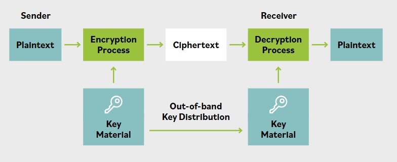

# Cifrado simetrico

**La caracteristica central de un algoritmo simetrico es que usa la misma clave tanto en el proceso de cifrado como en el proceso de descifrado. Se podria decir que el proceso de descifrado es una imagen especular del proceso de cifrado.**

**La misma clave se usa tanto para el proceso de cifrado como para el de descifrado. Esto significa que las dos partes que se comunican necesitan compartir el conocimiento de la misma clave.**

Este tipo de algoritmo protege los datos, ya que una persona que no tenga la clave correcta no podria leer el mensaje cifrado. Sin embargo, como la clave se comparte, esto puede generar varios desafios adicionales:

- Si dos partes sospechan que una ruta de comunicacion especifica entre ellas esta comprometida, obviamente no pueden compartir material de clave por esa ruta. Alguien que haya comprometido las comunicaciones entre las partes tambien interceptaria la clave.

- La distribucion de la clave es dificil, porque la clave no puede enviarse por el mismo canal que el mensaje cifrado, o el atacante man-in-the-middle (MITM) tendria acceso a la clave. Enviar la clave por un canal diferente (banda) al mensaje cifrado se denomina distribucion de claves out-of-band. Algunos ejemplos de distribucion de claves out-of-band incluyen enviar la clave por mensajero, fax o telefono.

- Cualquier parte que conozca la clave puede acceder al mensaje y, por lo tanto, cambiarlo.

- Cada individuo o grupo de personas que desee comunicarse tendria que usar una clave diferente para cada individuo o grupo con el que quiera conectarse. Esto plantea el desafio de escalabilidad: el numero de claves necesarias crece rapidamente a medida que aumenta el numero de usuarios o grupos diferentes. Bajo este tipo de esquema simetrico, una organizacion de 1,000 empleados tendria que gestionar 499,500 claves si cada empleado quisiera comunicarse confidencialmente con cada otro empleado.

**Usos principales de los algoritmos simetricos:**

- Cifrar datos masivos, por ejemplo backups, discos duros y medios portatiles

- Cifrar mensajes que atraviesan canales de comunicaciones, por ejemplo IPsec y TLS

- Transmitir datos a gran escala y sensibles al tiempo, por ejemplo materiales de audio/video y gaming

**Otros nombres para los algoritmos simetricos:**

- Misma clave

- Clave unica

- Clave compartida

- Clave secreta

- Clave de sesion

### Cifrado simetrico mediante anillo decodificador

Un ejemplo de cifrado simetrico es un cifrado por sustitucion, que implica el proceso simple de sustituir letras por otras letras o, de forma mas apropiada, sustituir bits por otros bits, basandose en una criptovariable. Estos cifrados implican reemplazar cada letra del texto claro por otra que puede encontrarse mas adelante en el alfabeto.

